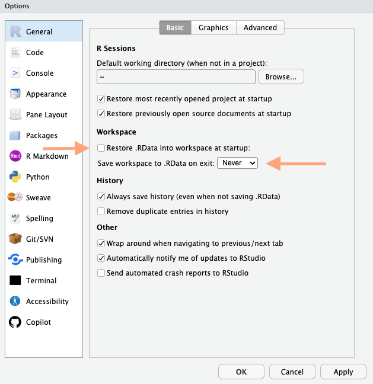

# Setting up R and RStudio {#sec-install}

::: {.callout-note}
## R is the language; the editor is a separate choice
You install **R** once, and then an editor to write it in. This chapter uses
**RStudio**, which is what the course assumes and the easiest place to start.

**Positron** is Posit's newer alternative, and it is covered in @sec-positron —
including what it does differently and how to set it up. You do not need it for
this course, and everything in this book works identically in either. Install R
first in both cases: neither editor bundles it.
:::

## Introduction to Installing R and RStudio

### Install R

* Install [R, a free software environment for statistical computing and graphics](https://www.r-project.org/#!) from [CRAN](https://cran.r-project.org/), the Comprehensive R Archive Network. 

1. Go to the [CRAN](https://cran.r-project.org/) website.
2. At the top of the page, choose your operating system:
   * **Windows**: Click on "Download R for Windows" and then "base". Click on the "Download R x.x.x for Windows" link to download the installer. Run the installer and follow the instructions.
   * **macOS**: Click on "Download R for (Mac) OS X". Click on the `.pkg` file link to download the installer. Open the downloaded file and follow the installation instructions.
   * **Linux**: Follow the instructions for your specific Linux distribution on the CRAN page.

### Install RStudio

* Install [RStudio, an integrated development environment (IDE) for R](https://posit.co/) from the [RStudio website](https://posit.co/) . RStudio makes R easier to use by providing a user-friendly interface and additional tools.

1. Go to the [RStudio Download](https://www.rstudio.com/products/rstudio/download/) page.
2. Under "Installers for Supported Platforms", choose your operating system:
   * **Windows**: Click on the "RStudio-Installer.exe" link to download the installer. Run the installer and follow the instructions.
   * **macOS**: Click on the "RStudio-Installer.dmg" link to download the installer. Open the downloaded file and follow the installation instructions.
   * **Linux**: Click on the "RStudio-Installer.deb" link for Debian-based distributions or the "RStudio-Installer.rpm" link for RedHat-based distributions. Follow the instructions for your specific Linux distribution.

### Update R and RStudio

#### Why Update?

Keeping R and RStudio up to date is important because updates often include:  

* **Bug fixes**: Resolving known issues that might affect performance and functionality.  
* **New features**: Adding new tools and capabilities that can make your work easier and more efficient.  
* **Packages**: Some packages may need newer versions of R to run.  

#### How to Update R

1. Visit the [CRAN](https://cran.r-project.org/) website.  
2. Download the latest version of R for your operating system following the installation instructions provided above.  
3. Install the new version of R. During installation, you can choose to keep your existing packages or reinstall them after the update.  

#### How to Update RStudio

1. Open RStudio.  
2. Go to `Help` > `Check for Updates`.  
3. If an update is available, follow the prompts to download and install the latest version.  
4. Alternatively, you can visit the [RStudio Download](https://www.rstudio.com/products/rstudio/download/) page and download the latest version for your operating system, then run the installer.  

### Install Packages

Packages are collections of R functions, data, and compiled code in a well-defined format. They extend the functionality of R and are stored in repositories like CRAN. To use additional functionality in R, you often need to install and load packages.

#### How to Install Packages

To install a package, use the `install.packages()` function. For example, to install the `ggplot2` package, you would run:

```r
install.packages("ggplot2")
```

You could also add the "dependecies = TRUE" if you want to be explicit about also installing additional packages that the package depends on.  

```r
install.packages("ggplot2",  dependencies = TRUE)
```

Once installed, you need to load the package into your R session with the library() function:  

```r
library(ggplot2)
```

# Work space 

To ensure each R-session always starts fresh, with no dataset or objects loaded, ensure you uncheck the box Restore .RData and that it never asks to save the whole workspace. Go to **Preferences > General**. Uncheck the option **Restore .RData into workspace at startup**. Select **Never** for the option to save your workspace.

**Reasons Not to Save RStudio Workspace:**

1. **Reproducibility**: Ensures scripts run consistently on any system.
2. **Memory Management**: Prevents slow performance due to large datasets.
3. **Clarity and Control**: Keeps the working environment clean and manageable.
4. **Avoiding Errors**: Reduces risks of unintended variable conflicts and errors.
5. **Best Practices**: Demonstrates that code is self-sufficient and robust.  

 [More on Rstudio](https://docs.posit.co/ide/user/ide/get-started/)


```{r}
#| label: fig-strawberry
#| echo: false
#| out.width: "50%"
#| out.height: "auto"
#| fig-cap: | 
#|   Now in RStudio, each new session starts empty, forgetting any code from prior sessions. You can recreate the environment using your quarto documents or R-scripts.
#| fig-alt: |
#|   A screenshot showing ChatGPT 4o screen and how many Rs there are in strawberry.


```


 
### Installing the tidyverse Package
```r
install.packages("tidyverse")
```

Then load the tidyverse package:
```r
library(tidyverse)```
```

### Getting Started with R and RStudio

Once you have installed both R and RStudio, you can open RStudio and start writing R code. RStudio provides a powerful environment for coding in R with features like syntax highlighting, code completion, and an integrated console.  


Here are some additional resources to help you get started:
* [R Documentation](https://www.rdocumentation.org/): Comprehensive documentation for R functions and packages.
* [RStudio Tutorials](https://www.rstudio.com/online-learning/): Tutorials and webinars to help you learn R and RStudio.

# Exercises

```{r echo = FALSE, results = 'asis'}
library(webexercises)
```


::: {.callout-note}
To use the exercises, you need to have a JavaScript-enabled browser.
:::

::: note

:::


What function loads a package that is already on your computer?  

`r webexercises::mcq(c("install.package", "install.packages", answer = "library", "libraries"))`  

What function is used to install packages in R?  

`r webexercises::mcq(c( answer = "install.packages()", "load.package()", answer = "library()", "source()"))`  

Which of the following is NOT a core package in the tidyverse?  

`r webexercises::mcq(c("ggplot2", "dplyr", answer = "data.table", "readr"))`  

How do you load the tidyverse package?  
`r webexercises::fitb(c("library( tidyverse )", "library( \"tidyverse\" )", "library( 'tidyverse' )"), ignore_ws = TRUE, width = "30")`  

How do you install the tidyverse package?  
`r webexercises::fitb(c("install.packages( 'tidyverse' )", 'install.packages("tidyverse")', 'install.packages( "tidyverse" )', "install.packages('tidyverse')"), ignore_ws = TRUE, width = "30")`  


```{r echo=FALSE}
opts_p <- c(
   "Base R is more user friendly",
   answer = "While base R provides a lot of functionality, packages like those in the tidyverse provide more advanced and user-friendly tools for data analysis and visualization.",
   "The Tidyverse is great for everything while base R is not"
)
```
What is the difference between base R and the Tidyverse   
`r longmcq(opts_p)`

# tangentkombinationer


book <https://stat545.com/index.html>

Materials for teaching <https://education.rstudio.com/teach/materials/>

tools for teaching <https://education.rstudio.com/teach/tools/>

version control and git <https://peerj.com/preprints/3159/> <https://happygitwithr.com/big-picture>

load packages recuangular data in compute something very important write rectangular data out rectangular data in make a figure save figure as pdf or png


https://datasciencebox.org/02-exploring-data
