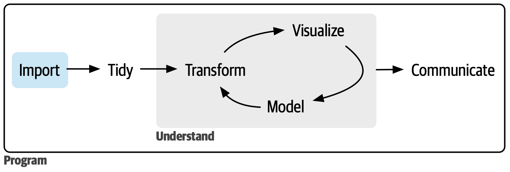

# Importing and Exporting Data {#sec-import}

::: {.callout-note}
## What this chapter covers
This chapter follows the lecture *Importera och exportera data*. It covers the
four ways to get data into R, why `setwd()` should be avoided, how the `here`
package solves the file-path problem, which format to save your results in,
how to read and write Excel workbooks with several sheets, and how Parquet
files handle data too large for CSV.
:::

```{r}
#| label: setup-import
#| include: false
library(webexercises)
```

```{r}
#| label: import-libs
#| message: false
library(tidyverse)
library(here)
```

Reading data in is the first line of almost every analysis script, and it is
where a surprising number of problems begin. A file path that works on your
laptop and nowhere else, a column of numbers imported as text, a Swedish decimal
comma silently turning 3,5 into a character string — all of these are import
problems, and all of them are cheaper to fix here than three steps later.

```{r}
#| label: fig-r4ds-import
#| echo: false
#| out.width: "70%"
#| fig-cap: |
#|   Import is the first step of the data science cycle. Figure from @wickham2023r4ds, used under CC BY-NC-ND 3.0.
#| fig-alt: |
#|   The data science cycle with the import step highlighted.

```

## Four ways to import

### 1. By clicking

RStudio has a graphical import wizard (Positron does not — see @sec-positron):

- **File → Import Dataset**
- Choose the file type, for example CSV or Excel.
- Follow the dialogue. You get a preview of the data, which is genuinely useful
  for checking delimiters and whether the first row is a header.
- RStudio generates the R code in the bottom-right of the dialogue.

**Copy that generated code into your script.** Clicking through the wizard again
next week is not reproducible; the line of code it produces is.

### 2. With base R

```{r}
#| eval: false
data_base <- read.csv("data/my_file.csv", header = TRUE)
head(data_base)
```

- **Advantage**: built in, no packages needed.
- **Disadvantage**: slower on large files, and older R versions converted text
  to factors automatically, which surprised a generation of users.

### 3. With `readr` (tidyverse)

```{r}
#| eval: false
library(readr)

data_tidy <- read_csv("data/my_file.csv")
```

- Faster and more predictable.
- Returns a tibble rather than a data frame.
- Guesses column types and, importantly, **tells you what it guessed** in a
  message. Read that message.

::: {.callout-important}
## Swedish CSV files
Swedish Excel exports usually use a **semicolon** as the field separator and a
**comma** as the decimal mark. `read_csv()` expects commas and periods, so it
will read the whole file into one column, or turn your numbers into text.

Use `read_csv2()` instead — it expects exactly the Swedish convention.

```{r}
#| eval: false
data_comma <- read_csv(here("data", "data_comma.csv")) # , separator, . decimal
data_semicolon <- read_csv2(here("data", "data_sv.csv")) # ; separator, , decimal
```

If you are unsure, open the file in a plain text editor and look at the first
two lines. This takes ten seconds and saves an hour.
:::

### 4. Other file types

```{r}
#| eval: false
# Excel
library(readxl)
data_excel <- read_excel(here("data", "my_file.xlsx"), sheet = "Results")

# SPSS, Stata, SAS
library(haven)
data_spss <- read_sav(here("data", "my_file.sav"))
data_stata <- read_dta(here("data", "my_file.dta"))
data_sas <- read_sas(here("data", "my_file.sas7bdat"))

# tab-separated text
data_txt <- read_tsv(here("data", "my_file.txt"))

# any delimiter you like
data_odd <- read_delim(here("data", "my_file.txt"), delim = "|")
```

::: {.callout-tip}
## `haven` keeps the SPSS labels
When you import an `.sav` file, `haven` preserves SPSS value labels as a
`labelled` class. That is useful — the labels are your codebook — but `labelled`
columns behave oddly in `ggplot2` and some models. Convert them explicitly when
you are ready: `haven::as_factor()` for categorical variables,
`haven::zap_labels()` to strip labels from numeric ones.
:::

## Useful arguments for reading files

Real files are rarely clean. These arguments handle most of what goes wrong:

```{r}
#| eval: false
read_csv(
  file = here("data", "messy.csv"),
  skip = 3, # skip 3 junk rows above the header
  na = c("", "NA", "999", "missing"), # values that mean "missing"
  col_types = cols( # override the guesses
    participant_id = col_character(), # keep leading zeros!
    date = col_date(format = "%Y-%m-%d"),
    weight_kg = col_double()
  ),
  locale = locale(encoding = "latin1") # old file where å, ä, ö come out wrong
)
```

::: {.callout-warning}
## ID numbers are text, not numbers
An ID like `00734` read as a number becomes `734`, and it will never join
correctly against the register file that still has the leading zeros. Personal
identity numbers have the same problem, plus they overflow the precision of a
double. Always read identifiers as `col_character()`.
:::

## Character encoding: UTF-8 and Latin-1

Sooner or later a file will arrive where `Göteborg` has turned into
`G\xf6teborg` or `Göteborg`. That is an **encoding** problem, and for anyone
working with Swedish text it is one of the most common import errors there is.

### What an encoding is

A file does not store letters. It stores bytes, and an **encoding** is the table
that says which bytes mean which character. The problem is that there is more
than one table:

| Encoding | Also called | What it covers | `å` is stored as |
|----------|-------------|----------------|------------------|
| **ASCII** | | English letters, digits, punctuation — 128 characters | *cannot store it* |
| **Latin-1** | ISO-8859-1 | ASCII plus Western European letters, one byte each | `e5` |
| **Windows-1252** | CP1252, "ANSI" | Latin-1 plus a few extras such as `€` | `e5` |
| **UTF-8** | | every character in every language — one to four bytes each | `c3 a5` |

You can see this in R:

```{r}
#| label: encoding-bytes
# the same letter, as UTF-8 bytes and as Latin-1 bytes
charToRaw("å")
charToRaw(iconv("å", from = "UTF-8", to = "latin1"))
```

Plain English letters are the same byte in all four encodings, which is why
encoding problems only show up once the file contains `å`, `ä`, `ö`, `é`, `ü`,
`€` or similar. A file can work for months and break the day someone named
Öberg joins the study.

### What goes wrong

Nothing in the file says which table was used. The program reading it has to
assume one, and if it assumes wrong, the bytes are decoded into the wrong
characters. To show it, we write a small file the way an older Swedish Excel or
SPSS export would — in Latin-1:

```{r}
#| label: encoding-make-file
#| message: false
library(tidyverse)

latin1_file <- tempfile(fileext = ".csv")

"city,n\nGöteborg,12\nMalmö,8\nÅre,3\n" |>
  iconv(from = "UTF-8", to = "latin1", toRaw = TRUE) |>
  unlist() |>
  writeBin(latin1_file)
```

`readr` assumes UTF-8, which is the right default — so reading this file
without saying otherwise gives:

```{r}
#| label: encoding-wrong
wrong <- read_csv(latin1_file, show_col_types = FALSE)

# print() shows the undecodable byte instead of failing - see below
print(wrong)
```

`\xf6` is R showing you a raw byte it could not interpret. (The `print()` is
there because this book normally formats tables with `knitr::kable()`, and
`kable()` stops with *input string 1 is invalid UTF-8* on this data — the same
problem, hitting the software that builds the book.) The data *looks*
nearly right, which is exactly what makes it dangerous, because nothing that
depends on the text works any more:

```{r}
#| label: encoding-wrong-consequences
# the city is there, but it will not match
wrong |> filter(city == "Göteborg") |> nrow()

# R can tell you the strings are not valid UTF-8
validUTF8(wrong$city)
```

A filter that returns zero rows, a join that silently fails to match, a
`count()` that splits one category into two. None of them raises an error.

Other functions do fail, and not always the same way:

```{r}
#| label: encoding-wrong-errors
#| error: true
# some base R text functions stop with an error ...
nchar(wrong$city)

# ... while stringr carries on without complaint
str_to_upper(wrong$city)
```

The first at least stops you. The second is worse. It upper-cases the letters
it recognises and passes the unreadable byte through untouched — the `\xf6` did
not become `Ö`, because R does not know it is an `ö` at all. The result is still
invalid, still matches nothing, and every value you derive from it inherits the
problem. Other programs will typically display that byte as `�`, which is how
`G�teborg` ends up in reports.

Telling `read_csv()` the actual encoding fixes it:

```{r}
#| label: encoding-right
right <- read_csv(
  latin1_file,
  locale = locale(encoding = "latin1"),
  show_col_types = FALSE
)

right

right |> filter(city == "Göteborg") |> nrow()
```

The opposite mistake — reading a UTF-8 file as if it were Latin-1 — produces
the other familiar pattern, where each Swedish letter becomes two characters:

```{r}
#| label: encoding-reverse
utf8_file <- tempfile(fileext = ".csv")
write_csv(right, utf8_file)

read_csv(utf8_file, locale = locale(encoding = "latin1"), show_col_types = FALSE) |>
  print()
```

`Åre` fares worst: its second byte decodes to an invisible control character,
shown here as `\u0085`.

::: {.callout-tip}
## Recognising the symptoms
| You see | What happened | Fix |
|---------|---------------|-----|
| `G\xf6teborg`, or `G�teborg` | a Latin-1 file read as UTF-8 | `locale(encoding = "latin1")` |
| `Göteborg`, `Malmö` | a UTF-8 file read as Latin-1 | read it as UTF-8 (the `readr` default) |
| `invalid multibyte string` error | a Latin-1 file read as UTF-8, by a function that refuses rather than shows it | `locale(encoding = "latin1")` |
| `€` missing, or a `NA` in its place | Windows-1252 file read as Latin-1 | `locale(encoding = "windows-1252")` |

The `Ã` pattern is worth memorising. When you see `Ã` followed by another odd
character where a Swedish letter should be, the file is UTF-8 and something
read it wrongly.
:::

### Finding out which encoding a file uses

`readr::guess_encoding()` looks at the bytes and makes an informed guess:

```{r}
#| label: encoding-guess
guess_encoding(latin1_file)
guess_encoding(utf8_file)
```

Treat it as a guess, not a verdict. The confidence for the Latin-1 file is low
here because the file is tiny and only three characters give it anything to go
on; Latin-1 and its Central European relative ISO-8859-2 look identical when
the only non-English letters are `ö` and `Å`. On a real file with more text it
does better. Confirm by reading the file and checking a few rows where you know
the right spelling.

::: {.callout-note}
## Latin-1 or Windows-1252?
Files described as "ANSI" by Windows, and most older Excel exports from a
Swedish Windows machine, are really **Windows-1252**. It is identical to
Latin-1 for `å`, `ä` and `ö`, so either setting works for those — but only
Windows-1252 has `€`, curly quotes and a few other symbols. If a file might
contain those, use `locale(encoding = "windows-1252")`.
:::

### Other functions, same idea

Every import function has a way to say the encoding:

```{r}
#| label: encoding-other-functions
#| eval: false
# base R: passed through to read.table()
read.csv("data/old_export.csv", fileEncoding = "latin1")

# SPSS files: haven usually detects it, but older .sav files can need help
haven::read_sav("data/survey.sav", encoding = "latin1")

# Excel .xlsx files store text as UTF-8 internally, so readxl does not need it
readxl::read_excel("data/register.xlsx")
```

### What is preferable: UTF-8, everywhere

**Use UTF-8 for everything you create** — scripts, Quarto documents, data you
save, files you send. It can represent every character in every language, it is
the default for `readr`, Quarto, Git, Positron and the web, and since R 4.2 it
is R's native encoding on Windows as well as macOS and Linux. Latin-1 cannot
store characters outside Western Europe at all, so a Latin-1 file cannot hold a
name like `Łukasz` or `Nguyễn`.

The practical rule has three parts:

1. **Convert at the door.** When a file arrives in another encoding, read it
   with the correct `locale(encoding = ...)` and from then on everything inside
   R is UTF-8. Do the conversion once, in your import script, with a comment
   saying why.
2. **Save your scripts as UTF-8.** In RStudio: *Tools → Global Options → Code →
   Saving → Default text encoding → UTF-8*. Positron and VS Code use UTF-8 by
   default. If an existing script opens with broken letters, *File → Reopen with
   Encoding* lets you read it correctly before saving it again as UTF-8.
3. **Write UTF-8, and help Excel read it.** `write_csv()` writes UTF-8. Excel,
   however, often assumes a CSV is in the Windows encoding unless the file
   starts with a special marker called a byte order mark — so a perfectly good
   UTF-8 file can open in Excel as `Göteborg`. When the file is going to
   someone who will open it in Excel, use `write_excel_csv()`, which adds the
   marker, or `write_excel_csv2()` for the semicolon-separated version that
   Swedish Excel expects:

```{r}
#| label: encoding-excel
excel_file <- tempfile(fileext = ".csv")
write_excel_csv2(right, excel_file)

# the first three bytes are the UTF-8 byte order mark Excel looks for
readBin(excel_file, "raw", n = 3)
```

::: {.callout-important}
## Keep Swedish letters in the data, not in the names
Everything above is about the *contents* of your data, where `å`, `ä` and `ö`
belong and must be preserved. For the *names* of objects and columns the advice
in @sec-classes still applies: use plain `a` and `o`, and `janitor::clean_names()`
will do the conversion for you (@sec-cleaning). A column called `ålder` is one
wrongly-encoded script away from an `object not found` error that is very hard
to diagnose.
:::

::: {.webex-check .webex-box}
**Check yourself**

A file shows `Malmö` where it should say `Malmö`. The file is most likely
`r mcq(c("Latin-1, read as Latin-1", answer = "UTF-8, read as if it were Latin-1", "corrupted beyond repair", "ASCII"))`

Which encoding should you use for files you create?
`r mcq(c("Latin-1", "Windows-1252", answer = "UTF-8", "ASCII"))`

A wrongly decoded city name will still match in `filter(city == "Göteborg")`.
`r torf(FALSE)`

To send a CSV to a colleague who opens it in Swedish Excel, use
`r mcq(c("write.csv()", "write_csv()", answer = "write_excel_csv2()", "saveRDS()"))`
:::

## Do not use `setwd()`

```{r}
#| label: fig-setwd
#| echo: false
#| out.width: "55%"
#| fig-cap: |
#|   setwd() breaks easily; R projects and here() do not. Artwork by Allison Horst, CC BY 4.0.
#| fig-alt: |
#|   A cracked glass cube labelled setwd with bandages looks on at a sturdy cube labelled R Proj and a small cube labelled here doing a skateboard trick.

```

```{r}
#| eval: false
setwd("C:/Users/daniel/OneDrive/projects/study_2024/data")
data <- read.csv("my_file.csv")
```

Why this is a bad idea:

- **Fragile**: works only on one machine, in one folder.
- **Hard to maintain**: rename or move the folder and the script breaks.
- **Not portable**: a new computer, a co-author, or the same project on a server
  all require editing the path.
- **Not reproducible**: the reviewer who downloads your code cannot run it.

## The `here` package {#sec-here}

```{r}
#| label: fig-here
#| echo: false
#| out.width: "65%"
#| fig-cap: |
#|   here: find your path. Artwork by Allison Horst, CC BY 4.0.
#| fig-alt: |
#|   A monster leaves a spooky forest of absolute file paths and setwd calls for a bright path with signs saying here.

```

`here()` builds paths relative to the **root of your project**, so the same line
of code works on every machine.

```{r}
#| eval: false
library(here)

data_here <- read_csv(here("data", "my_file.csv"))
```

Each argument is one level of folders, and `here()` joins them with the right
separator for your operating system. `here("data/my_file.csv")` also works, but
the comma form is easier to build from variables.

Advantages:

- Readable and reproducible.
- Works the same in RStudio, Positron, a terminal and a Quarto document.
- The project can be shared, moved, or synced through OneDrive and still work.
- You can step out of the project with `".."`, e.g.
  `here("..", "shared_data", "register.csv")`.

### How `here()` finds the root

When `here` is loaded, it starts in the current working directory and walks
**upwards**, one parent folder at a time, until it finds a folder containing a
root marker: an `.Rproj` file, a `.git` folder, `.vscode/settings.json`,
`_quarto.yml`, `renv.lock`, a `.here` file, and a few more. The first such
folder becomes the root for the rest of the session. The full list is in
@sec-projects.

Two consequences matter in practice:

1. **The search starts from the working directory**, so what `here()` finds
   depends on how you opened the project.
2. **The root is fixed once found.** Changing the working directory afterwards
   with `setwd()` does not move it. That makes `here()` robust, but it also means
   that if you switch to another project in the same R session, `here()` still
   points at the first one. Restart R when you switch projects.

When a path does not resolve the way you expect, ask `here` to explain itself:

```{r}
#| label: here-demo
#| message: true
# which folder is the root, and which marker decided it
here::dr_here()
```

### In RStudio

Open the project by double-clicking the `.Rproj` file, or through
**File → Open Project**, or the project menu in the top-right corner. RStudio
then starts a fresh R session with the working directory set to the project
folder, and `here()` finds the `.Rproj` straight away.

- The project name in the top-right corner tells you which project you are in.
  If it says **Project: (None)**, you are not in one, and `here()` will search
  from whatever the working directory happens to be.
- Switching project through the same menu restarts R, so `here()` is reset for
  you.
- If you opened a script without its project, **Session → Restart R**
  (<kbd>Ctrl/Cmd</kbd>+<kbd>Shift</kbd>+<kbd>F10</kbd>) after opening the project
  resets `here()`.

### In Positron

Open the project with **File → Open Folder**. The folder you open becomes the
working directory, and `here()` searches upwards from there.

- **Open the project folder itself, not a folder above it.** If you open
  `OneDrive/courses/` which holds five projects, the working directory is
  `courses/`, and `here()` either finds nothing or finds a marker in a folder
  even higher up. Everything then resolves relative to the wrong place.
- A project created with **New Folder from Template** has a `.git` folder, which
  is a root marker, so `here()` works without an `.Rproj` file.
- A plain folder with no marker at all works while it is the folder you have
  open, because `here()` falls back to the working directory. It breaks as soon
  as the working directory is anything else. Run `here::set_here()` once to
  write an empty `.here` file and make the root explicit.
- The folder name shown at the top of the window is the workspace you are in.
  Opening another folder starts a new R session, so `here()` is reset.

### In Quarto documents

This is where `here()` earns its keep. When you render a `.qmd` file, its code
runs with the working directory set to **the folder the document is in**, not
the project root. A report stored in `reports/analysis.qmd` then looks for
`read_csv("data/study.csv")` in `reports/data/`, which does not exist, even
though the same line worked in the console.

`here("data", "study.csv")` works in both places, because `here()` walks up from
`reports/` and finds the project root.

### Declaring where a script lives with `i_am()`

For scripts you will share, put `here::i_am()` at the top and give the script's
own path relative to the project root:

```{r}
#| eval: false
here::i_am("analysis/01_clean.R")

library(tidyverse)
library(here)
```

`i_am()` does two things. It uses the script's location to find the root, so
it does not depend on markers. And it **stops with an error** if no parent
folder contains `analysis/01_clean.R`, for example because someone ran the
script from the wrong project. An error on line 1 is much better than a
script that runs to the end on the wrong data.

::: {.callout-tip}
## The recommended setup
1. Always work in a project: an `.Rproj` in RStudio, an opened folder under Git
   in Positron.
2. Use `here()` for every file path.
3. Use `readr` functions for text files.
4. Never use an absolute path in a script you intend to keep.
5. Restart R when you switch projects.

If you work on several computers and keep the project in a cloud folder, this
combination is the difference between code that runs everywhere and code that
runs on one laptop.
:::

## Saving data

You save data to avoid redoing work, to share results, and to separate slow
steps from fast ones. In a multi-step project, saving the cleaned dataset means
you never have to re-run the cleaning to make one more figure.

### CSV

```{r}
#| eval: false
# base R
write.csv(data, "data_output.csv", row.names = FALSE)

# readr - faster, and no row-names nonsense
write_csv(data, here("data", "data_output.csv"))
```

### RDS

RDS saves a single R object exactly as it is, preserving factor levels, column
types, attributes and the tibble class.

```{r}
#| eval: false
saveRDS(data, here("data", "data_output.rds"))
data <- readRDS(here("data", "data_output.rds"))
```

This is the right format for intermediate results — a cleaned dataset, or a
model that took twenty minutes to fit.

### Excel

```{r}
#| eval: false
library(writexl)
write_xlsx(data, here("output", "data_output.xlsx"))
```

Several sheets, formatting and adding to an existing workbook are covered in
@sec-excel.

## Which format should you choose?

| Format | Advantages | Disadvantages |
|--------|------------|---------------|
| **CSV** | Readable by every program; plain text; diffs nicely in Git | Loses all metadata — factor levels, date formats, column types |
| **RDS** | Preserves everything R-specific exactly | Only readable in R; binary, so Git cannot diff it |
| **XLSX** | Easy to share with Excel users; multiple sheets | Inefficient for large data; invites manual editing |
| **Parquet** | Fast, compressed, keeps types; read one column at a time; readable from R, Python and DuckDB | Needs the `arrow` (or `nanoparquet`) package; not human-readable |

Recommendations:

- **To share with others**: CSV, or Excel if the recipient insists.
- **To preserve types, or to save a model object**: RDS.
- **For large datasets, or to share with Python users**: Parquet via the
  `arrow` package (see @sec-parquet).
- Use `readr` and `here` throughout.

::: {.callout-important}
## Never overwrite your raw data
Raw data is written once and read forever. Keep it in a separate folder, treat
it as read-only, and write every cleaned version to a different file. If a
cleaning step turns out to be wrong, you want to be able to go back — and you
cannot go back to a file you have already overwritten.

For registry data under ethical approval, this is not just good practice. Add
`data/` and `*.csv`, `*.sav`, `*.rds`, `*.parquet` to `.gitignore` **before** your first
commit, so that identifiable data never enters version control.
:::

## Working with Excel files {#sec-excel}

Excel files are everywhere: data from a collaborator, a lab export, a table a
journal asks for. There are three packages to know, one for reading and two for
writing:

| Package | Does | Use it when |
|---------|------|-------------|
| `readxl` | Reads `.xls` and `.xlsx` | Always, for reading. Installed with the tidyverse. |
| `writexl` | Writes data frames to `.xlsx`, one sheet per data frame | You just need the data in Excel. |
| `openxlsx2` | Builds workbooks: formatting, column widths, frozen headers, adding sheets to an existing file | The file is for people to read. |

None of them needs Excel installed. You may also meet `openxlsx`, the older
package that `openxlsx2` replaces. The function names differ (`addWorksheet()`
rather than `wb_add_worksheet()`), but the ideas are the same, and new code
should use `openxlsx2`.

```{r}
#| label: excel-libs
#| message: false
library(readxl)
library(writexl)
library(palmerpenguins)
```

### Writing several sheets at once

`write_xlsx()` takes a data frame, or a **named list** of data frames. Each
element of the list becomes a sheet, named after the element. `split()` gives
you such a list in one step:

```{r}
#| label: excel-write-sheets
# one sheet per species
by_species <- penguins |>
  split(~species)

names(by_species)

xlsx_file <- tempfile(fileext = ".xlsx")
write_xlsx(by_species, xlsx_file)
```

The same pattern works for any list you build yourself, for example
`list(summary = summary_table, data = cleaned_data)`.

### Reading sheets

`excel_sheets()` lists the sheets in a file, and the `sheet` argument of
`read_excel()` takes either a name or a position. Use the name: a colleague who
inserts a new first sheet will silently change what `sheet = 1` means.

```{r}
#| label: excel-read-sheets
excel_sheets(xlsx_file)

gentoo <- read_excel(xlsx_file, sheet = "Gentoo")
dim(gentoo)
```

To read **all** sheets and stack them, map over the sheet names and keep the
name as a column:

```{r}
#| label: excel-read-all
all_sheets <- excel_sheets(xlsx_file) |>
  set_names() |>
  map(\(s) read_excel(xlsx_file, sheet = s)) |>
  list_rbind(names_to = "sheet")

# check that nothing was lost on the way
count(all_sheets, sheet)
nrow(all_sheets) == nrow(penguins)
```

`set_names()` without arguments names the vector after its own values, so
`list_rbind(names_to = "sheet")` knows which sheet each row came from. (The
functions `map()` and `list_rbind()` are covered in @sec-functions.)

Note that `species` came back as character: Excel, like CSV, has no factors.

### Messy spreadsheets

Spreadsheets made for people often have a title, notes or empty rows above the
table. `read_excel()` has arguments for the usual problems:

```{r}
#| eval: false
read_excel(
  here("data", "lab_results.xlsx"),
  sheet = "Results",
  range = "B4:F120", # read exactly this block, ignoring notes around it
  na = c("", "NA", "-", "missing") # every way the file says "no value"
)

read_excel(
  here("data", "lab_results.xlsx"),
  sheet = "Results",
  skip = 3 # or: skip the three title rows and read everything below
)
```

`range` also accepts a sheet and a range together, like `"Results!B4:F120"`.

The problem that surprises people most is **dates**. Excel stores a date as the
number of days since 30 December 1899 and only *displays* it as a date. If a
column has dates in some cells and text in others, `read_excel()` reads it as
text, and the dates come out as numbers like `"45292"`. Convert them with the
right origin:

```{r}
#| label: excel-dates
as.Date(45292, origin = "1899-12-30")
```

`janitor::excel_numeric_to_date()` does the same with a friendlier name.

### Formatted workbooks with `openxlsx2`

`writexl` writes plain data. When the file is for a person, a collaborator or a
report appendix, you often want bold headers, sensible column widths, a frozen
first row and numbers rounded for display. `openxlsx2` builds the workbook step
by step with a pipe of `wb_*()` functions:

```{r}
#| label: excel-openxlsx2
#| message: false
library(openxlsx2)

mass_summary <- penguins |>
  summarise(
    n = n(),
    mean_mass = mean(body_mass_g, na.rm = TRUE),
    .by = species
  )

report_file <- tempfile(fileext = ".xlsx")

wb_workbook() |>
  # sheet 1: a summary formatted for reading
  wb_add_worksheet("summary") |>
  wb_add_data(x = mass_summary) |>
  wb_add_font(dims = "A1:C1", bold = TRUE) |>
  wb_add_numfmt(dims = "C2:C4", numfmt = "0.0") |>
  wb_set_col_widths(cols = 1:3, widths = "auto") |>
  wb_freeze_pane(first_row = TRUE) |>
  # sheet 2: the underlying data
  wb_add_worksheet("data") |>
  wb_add_data(x = penguins) |>
  wb_save(report_file)

excel_sheets(report_file)
```

`dims` uses Excel's own cell notation. The number format changes only how the
value is **shown**: the cell still holds the full-precision mean, which is what
you want if someone recalculates from it.

To **add a sheet to a file that already exists**, load it, add, and save. This
is something `writexl` cannot do; it always writes a new file.

```{r}
#| label: excel-add-sheet
wb_load(report_file) |>
  wb_add_worksheet("adelie") |>
  wb_add_data(x = by_species$Adelie) |>
  wb_save(report_file)

excel_sheets(report_file)
```

::: {.callout-warning}
## Two functions called `write_xlsx()`
`openxlsx2` also has a `write_xlsx()`, so loading it after `writexl` masks
the `writexl` version. They take similar arguments, but to be sure which one you
are calling, write `writexl::write_xlsx()` or `openxlsx2::write_xlsx()`.
:::

::: {.callout-tip}
## Excel as an output, not a workspace
Write to Excel at the **end** of a pipeline, from code, and never edit that file
by hand and read it back in. A number changed in a cell leaves no trace, and the
next time the code runs it is overwritten. If someone needs to correct data,
the correction goes into the cleaning code, where it is visible and repeatable.
:::

## Parquet files {#sec-parquet}

CSV works fine until your data gets large. Accelerometer data, registry
extracts covering a whole population, or a few years of repeated measurements
can easily reach millions of rows. A CSV of that size is slow to read, takes up
a lot of disk space, and loses every column type on the way. **Parquet** is the
format designed for exactly this job.

### What Parquet is

A Parquet file is a binary file that stores a table **column by column** rather
than row by row. That one design choice explains most of its advantages:

- **Types are stored in the file.** Dates stay dates, integers stay integers,
  and factors come back as factors. Nothing has to be guessed at import.
- **Columns compress well.** A column holds values of one type, often
  repeating, so it compresses far better than mixed rows of text.
- **You can read only the columns you need.** Each column is stored
  separately, so reading 3 of 200 columns means reading roughly 3/200 of the
  file.
- **Any language can read it.** Parquet is an open standard. Python (pandas,
  polars), DuckDB and Spark all read the same file, which makes it a
  good way to hand data between an R user and a Python user.

The downside is that you cannot open it in a text editor or in Excel. For a
small table that a person will read, CSV or Excel is still the better choice.

### Reading and writing

The main package is `arrow`, the R interface to Apache Arrow. It has
`write_parquet()` and `read_parquet()`, which work just like their `readr`
counterparts:

```{r}
#| label: parquet-libs
#| message: false
library(arrow)
```

To see the difference, simulate a dataset with a realistic size: 20,000
participants with five visits each, making 100,000 rows. We write it to a
temporary folder so the example leaves nothing behind.

```{r}
#| label: parquet-simulate
# simulated visits - no real participants involved
set.seed(2026)
visits <- tibble(
  id = sprintf("P%05d", rep(1:20000, each = 5)),
  visit_date = as.Date("2024-01-01") + sample(0:700, 1e5, replace = TRUE),
  clinic = factor(
    sample(c("Stockholm", "Göteborg", "Malmö"), 1e5, replace = TRUE),
    # a deliberate, non-alphabetical order
    levels = c("Stockholm", "Göteborg", "Malmö")
  ),
  steps = round(rnorm(1e5, mean = 8000, sd = 2500)),
  bmi = round(rnorm(1e5, mean = 25, sd = 4), 1)
)

out_dir <- tempfile("parquet_demo")
dir.create(out_dir)

write_csv(visits, file.path(out_dir, "visits.csv"))
saveRDS(visits, file.path(out_dir, "visits.rds"))
write_parquet(visits, file.path(out_dir, "visits.parquet"))

# file sizes in megabytes
file.size(file.path(out_dir, c("visits.csv", "visits.rds", "visits.parquet"))) / 1e6
```

The Parquet file is about a fifth the size of the CSV. RDS is about as small,
because `saveRDS()` compresses too. What RDS cannot do is everything else in
the list above: be read by other languages, or be read one column at a time.

Now read both files back and compare the column types:

```{r}
#| label: parquet-types
visits_csv <- read_csv(file.path(out_dir, "visits.csv"), show_col_types = FALSE)
visits_pq <- read_parquet(file.path(out_dir, "visits.parquet"))

# class of each column after the round trip
map_chr(visits_csv, \(x) class(x)[1])
map_chr(visits_pq, \(x) class(x)[1])

# the level order we chose survives only in the Parquet file
levels(visits_pq$clinic)
levels(factor(visits_csv$clinic))

identical(visits, visits_pq)
```

The CSV round trip turned `clinic` into text; if you convert it back to a factor
you get alphabetical order, and your reference group changes without warning.
The Parquet round trip gives back an object that is `identical()` to the one
you saved.

To read only some columns, use `col_select`, which takes the same helpers as
`select()`:

```{r}
#| label: parquet-col-select
read_parquet(
  file.path(out_dir, "visits.parquet"),
  col_select = c(id, steps)
) |>
  dim()
```

### Data larger than memory: `open_dataset()`

`read_parquet()` loads the whole file into memory, like every other reader in
this chapter. For data that does not fit in memory, or that is split over many
files, `arrow` can do something more useful: leave the data on disk and let you
query it with `dplyr` verbs.

First, save the data as a **dataset**, a folder of Parquet files split by the
value of a column (here, the year):

```{r}
#| label: parquet-write-dataset
visits |>
  mutate(year = year(visit_date)) |>
  write_dataset(file.path(out_dir, "visits_by_year"), partitioning = "year")

list.files(file.path(out_dir, "visits_by_year"), recursive = TRUE)
```

Then open it and write an ordinary `dplyr` pipe. Nothing is read yet: `arrow`
only records what you asked for.

```{r}
#| label: parquet-query
visits_ds <- open_dataset(file.path(out_dir, "visits_by_year"))

active_2025 <- visits_ds |>
  filter(year == 2025, steps > 10000) |>
  summarise(n = n(), mean_bmi = mean(bmi), .by = clinic)

class(active_2025)
```

`collect()` runs the query and returns an ordinary tibble:

```{r}
#| label: parquet-collect
active_2025 |>
  collect()
```

Two things make this fast. `filter(year == 2025)` means the 2024 file is never
opened at all, because the year is in the folder name. Inside the 2025 file,
only the four columns the query uses are read. On a dataset of a few gigabytes
this can be the difference between a query taking seconds and not fitting in
memory at all.

Most common `dplyr` verbs work on an Arrow dataset: `filter()`, `select()`,
`mutate()`, `summarise()`, `arrange()` and joins, along with many `stringr` and
`lubridate` functions. If you use a function that Arrow cannot translate, you
get an error that tells you so. The fix is to `filter()` and `select()` first,
so the data is small, then `collect()` and continue in ordinary R.

::: {.callout-tip}
## Alternatives to `arrow`
- **`nanoparquet`** has `read_parquet()` and `write_parquet()` with no
  dependencies, and installs in seconds. It is a good choice if all you need is
  to read and write files that fit in memory.
- **`duckplyr`** (and `duckdb`) can query Parquet files directly with
  `read_parquet_duckdb()`, in the same lazy way as `open_dataset()`.

Both read the same files as `arrow`, so you can mix them.
:::

::: {.callout-important}
## Parquet and sensitive data
Parquet is compressed, **not encrypted**. A Parquet file of registry data is
exactly as sensitive as the CSV it came from, only smaller and easier to copy.
Keep it in the same protected location, and add `*.parquet` to `.gitignore`
together with the other data formats.
:::

## `::` without `library()`

```{r}
#| eval: false
write_csv(data, here::here("data", "data_output.csv"))
```

Writing `here::here()` calls the function directly from the package without
attaching the whole package with `library()`. Two reasons to do it:

- It makes the source of an unfamiliar function obvious to your reader.
- It avoids conflicts when two packages export the same function name — the
  classic case being `dplyr::filter()` versus `stats::filter()`.

::: {.webex-check .webex-box}
**Check yourself**

Which function reads a Swedish CSV file with `;` separators and `,` decimals?
`r mcq(c("read_csv()", answer = "read_csv2()", "read.csv()", "read_tsv()"))`

`here()` builds paths relative to your project root. `r torf(TRUE)`

You render `reports/analysis.qmd`, which contains `read_csv("data/study.csv")`.
Where does R look for the file?
`r longmcq(c(
  "In data/ in the project root",
  answer = "In reports/data/, because a rendered document runs in its own folder",
  "In your home folder",
  "Wherever setwd() was last called in the console"
))`

In Positron you open a folder that contains five different projects. What
happens to `here()`?
`r longmcq(c(
  "It asks which project you mean",
  "It picks the most recently modified project",
  answer = "It searches from the opened folder upwards, so it cannot find any of the five project roots below it",
  "Nothing; Positron sets the root for each file automatically"
))`

Which format preserves factor levels and column types exactly?
`r mcq(c("CSV", answer = "RDS", "XLSX", "TXT"))`

How do you write three data frames to three sheets of one `.xlsx` file?
`r longmcq(c(
  "Call write_xlsx() three times with the same file name",
  answer = "Pass a named list of the three data frames to write_xlsx()",
  "It cannot be done from R",
  "Use write_csv() with sheet = 1, 2, 3"
))`

A date column in Excel comes back as numbers like 45292. What are they?
`r longmcq(c(
  "Seconds since 1970",
  answer = "Days since 30 December 1899, Excel's date origin",
  "A corrupted file",
  "Row numbers"
))`

What does `open_dataset()` return before you call `collect()`?
`r longmcq(c(
  "A tibble with all rows loaded into memory",
  answer = "A reference to data on disk; the query only runs at collect()",
  "A CSV file",
  "An error, because dplyr verbs do not work on Parquet"
))`

A Parquet file is encrypted, so it is safe to email registry data as Parquet. `r torf(FALSE)`

Why should a participant ID be read as character rather than numeric?
`r longmcq(c(
  "Because character columns take less memory",
  answer = "Because leading zeros are lost when an ID is read as a number, which breaks later joins",
  "Because dplyr cannot join on numeric columns",
  "There is no reason; numeric is preferable"
))`
:::

::: {.callout-note collapse="true"}
## Exercise 1: a full round trip

Practise the import-modify-export cycle without needing any external file.

1. Create a folder `data/` in your project.
2. Write the `penguins` dataset to `data/penguins_raw.csv` using `write_csv()`
   and `here()`.
3. Read it back in with `read_csv()`. Look at the message about column types.
4. Compare `class(penguins$species)` before saving with the class after reading
   back in. What happened, and why?
5. Save the same data as RDS instead and repeat step 4.

::: {.callout-tip collapse="true"}
## Solution

```{r}
#| eval: false
library(tidyverse)
library(palmerpenguins)
library(here)

dir.create(here("data"), showWarnings = FALSE)

write_csv(penguins, here("data", "penguins_raw.csv"))
penguins_csv <- read_csv(here("data", "penguins_raw.csv"))

class(penguins$species) # "factor"
class(penguins_csv$species) # "character"

saveRDS(penguins, here("data", "penguins_raw.rds"))
penguins_rds <- readRDS(here("data", "penguins_raw.rds"))

class(penguins_rds$species) # "factor"
```

A CSV file is plain text. It has no way to record that `species` was a factor
with three specific levels in a specific order, so `read_csv()` reads it back as
character. RDS stores the R object itself, so everything survives.

This matters in practice: if you carefully ordered your factor levels during
cleaning and then round-trip through CSV, that ordering is silently gone, and
your figures and model reference groups change.
:::
:::

::: {.callout-note collapse="true"}
## Exercise 2: diagnose the import

A colleague sends you a file and complains that "R has broken the numbers".
Their code and the first lines of the file look like this:

```
id;weight;height;group
001;72,5;181;kontroll
002;68,0;175;intervention
```

```{r}
#| eval: false
d <- read_csv("data/study.csv")
```

1. Predict what goes wrong. There are at least three separate problems.
2. Write the corrected import call.

::: {.callout-tip collapse="true"}
## Solution

The problems:

1. The separator is `;`, not `,`. `read_csv()` will read every line into a
   single column.
2. The decimal mark is `,`. Even with the right separator, `72,5` would be read
   as text.
3. `id` has leading zeros. Read as a number it becomes `1`, `2` and will not
   join to anything.

```{r}
#| eval: false
d <- read_csv2(
  here("data", "study.csv"),
  col_types = cols(
    id = col_character(), # keep the leading zeros
    weight = col_double(),
    height = col_double(),
    group = col_factor()
  )
)
```

`read_csv2()` handles the first two problems in one function; `col_types` fixes
the third. Always run `glimpse()` straight after importing and confirm that
every column has the type you expected.
:::
:::

::: {.callout-note collapse="true"}
## Exercise 3: from CSV to Parquet

1. Write `penguins` to a Parquet file with `write_parquet()`.
2. Read it back and check whether `species` is still a factor with the same
   levels.
3. Read back only `species` and `body_mass_g` using `col_select`.
4. Write `penguins` as a dataset partitioned by `island` with
   `write_dataset()`. How many files are created, and where did the `island`
   column go?
5. Use `open_dataset()` and a `dplyr` pipe to compute the mean body mass per
   species on Biscoe island, and `collect()` the result.

::: {.callout-tip collapse="true"}
## Solution

```{r}
#| eval: false
library(tidyverse)
library(arrow)
library(palmerpenguins)
library(here)

write_parquet(penguins, here("data", "penguins.parquet"))

penguins_pq <- read_parquet(here("data", "penguins.parquet"))
levels(penguins_pq$species) # "Adelie" "Chinstrap" "Gentoo", as before

read_parquet(
  here("data", "penguins.parquet"),
  col_select = c(species, body_mass_g)
)

penguins |>
  write_dataset(here("data", "penguins_by_island"), partitioning = "island")

list.files(here("data", "penguins_by_island"), recursive = TRUE)

open_dataset(here("data", "penguins_by_island")) |>
  filter(island == "Biscoe") |>
  summarise(mean_mass = mean(body_mass_g, na.rm = TRUE), .by = species) |>
  collect()
```

Three files are created, one folder per island (`island=Biscoe/part-0.parquet`
and so on). The `island` column is no longer stored inside the files: its value
is in the folder name, and `open_dataset()` adds it back as a column. That is
why filtering on `island` is so cheap — Arrow only has to open one folder.
:::
:::
