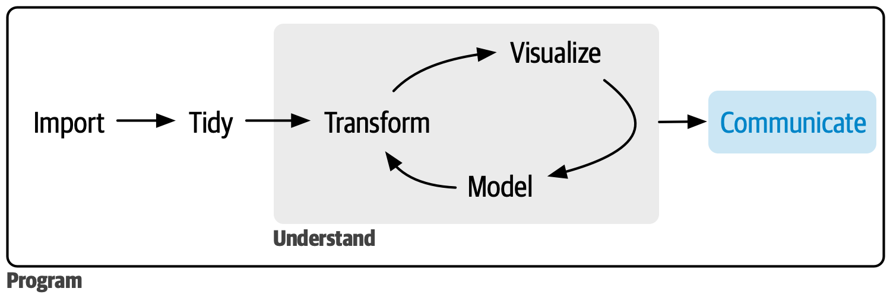

# Tables {#sec-tables}

::: {.callout-note}
## What this chapter covers
This chapter follows the lecture *Tabeller*. It covers building a summary table
by hand with the tidyverse, the main table packages, and `gtsummary` for
publication-ready "Table 1" and regression tables, exported to Word. Written
for gtsummary 2.6 and gt 1.3.
:::

```{r}
#| label: setup-tables
#| include: false
library(webexercises)
```

```{r}
#| label: tables-libs
#| message: false
library(tidyverse)
library(palmerpenguins)
library(gt)
library(gtsummary)
```

A table and a figure answer different questions. A **figure** shows shape,
spread and relationship; a **table** gives exact values that a reader can quote,
compare or reuse. If a reader needs to know that the mean was 4207 g rather than
"about 4200", they need a table.

The first table in almost every health-science paper is the same: sample
characteristics, by group. It is worth being able to produce it quickly and
correctly.

```{r}
#| label: fig-r4ds-communicate
#| echo: false
#| out.width: "70%"
#| fig-cap: |
#|   Communicating results is the last step of the data science cycle. Figure from @wickham2023r4ds, used under CC BY-NC-ND 3.0.
#| fig-alt: |
#|   The data science cycle with the communicate step highlighted.

```

## Building a table by hand

You can build any table with `dplyr` and `tidyr`. It is more work than a
dedicated package, but it is completely transparent, and it is the right
approach whenever your table does not fit a standard shape.

```{r}
#| label: table-manual
continuous_summary <- penguins |>
  drop_na(sex) |>
  summarise(
    across(
      c(bill_length_mm, flipper_length_mm, body_mass_g),
      list(
        mean = \(x) mean(x, na.rm = TRUE),
        sd = \(x) sd(x, na.rm = TRUE)
      )
    ),
    n = n(),
    .by = species
  ) |>
  # fold the group size into the column label, so n does not have to be
  # carried along as a separate column through the pivots
  mutate(species_label = sprintf("%s (n = %d)", species, n)) |>
  # long format makes it easy to combine mean and sd into one cell
  pivot_longer(
    cols = !c(species, species_label, n),
    names_to = c("variable", "statistic"),
    names_pattern = "(.*)_(mean|sd)$"
  ) |>
  pivot_wider(names_from = statistic, values_from = value) |>
  mutate(summary = sprintf("%.1f (%.1f)", mean, sd)) |>
  select(variable, species_label, summary) |>
  pivot_wider(names_from = species_label, values_from = summary)

continuous_summary
```

::: {.callout-warning}
## Why `n` cannot just come along for the ride
The step that folds `n` into the label is not cosmetic. If you keep `n` as an
ordinary column and pivot wider on `species`, `n` becomes part of the row
identity — and since each species has a different `n`, every species-variable
combination gets its own row:

```{r}
#| label: table-manual-broken
penguins |>
  drop_na(sex) |>
  summarise(
    mean_mass = mean(body_mass_g, na.rm = TRUE),
    n = n(),
    .by = species
  ) |>
  # n is not named in pivot_wider(), so it silently becomes an id column
  pivot_wider(names_from = species, values_from = mean_mass)
```

Three rows where you wanted one, and two thirds of the table is `NA`.

This is the single most common `pivot_wider()` mistake, and it is worth
recognising the signature: **a mostly empty table is almost never a missing-data
problem.** It means an unintended column is acting as a row identifier
(@sec-pivot). Everything not named in `names_from` or `values_from` defines the
rows, so drop or fold in anything that should not.
:::

::: {.callout-tip}
## `sprintf()` and `round()` are not the same
`round(4.20, 1)` prints as `4.2` — R drops the trailing zero, so a column of
"4.2, 4.25, 4.3" looks ragged. `sprintf("%.1f", ...)` always prints the same
number of decimals, which is what you want in a table. Alternatively, use the
`digits` argument of your table package and let it handle formatting.
:::

Made presentable with `gt`:

```{r}
#| label: table-manual-gt
continuous_summary |>
  mutate(
    variable = recode_values(
      variable,
      "bill_length_mm" ~ "Bill length (mm)",
      "flipper_length_mm" ~ "Flipper length (mm)",
      "body_mass_g" ~ "Body mass (g)"
    )
  ) |>
  gt(rowname_col = "variable") |>
  tab_header(
    title = "Penguin measurements by species",
    subtitle = "Mean (SD); penguins with unknown sex excluded"
  ) |>
  tab_source_note("Data: palmerpenguins")
```

## Table packages

R has several table packages, each with a different emphasis:

| Package | Best for | Output formats |
|---------|----------|----------------|
| **gt** | Full control over appearance; the tidyverse-adjacent standard | HTML, LaTeX, RTF, Word |
| **gtsummary** | Summary and regression tables with almost no code | everything `gt` supports |
| **flextable** | Word and PowerPoint output | Word, PowerPoint, HTML, PDF |
| **DT** | Interactive tables the reader can sort and search | HTML only |
| **knitr::kable** | Quick tables in a report, no dependencies | all |
| **tinytable** | Lightweight, few dependencies | HTML, LaTeX, Word, Typst |

### `kable()`: the quickest option

```{r}
#| label: table-kable
penguins |>
  summarise(
    n = n(),
    mean_mass = round(mean(body_mass_g, na.rm = TRUE), 0),
    .by = species
  ) |>
  knitr::kable(
    col.names = c("Species", "n", "Mean body mass (g)"),
    caption = "A quick table with kable()"
  )
```

### `gt`: full control

```{r}
#| label: table-gt
penguins |>
  drop_na(sex) |>
  summarise(
    n = n(),
    mean_mass = mean(body_mass_g, na.rm = TRUE),
    sd_mass = sd(body_mass_g, na.rm = TRUE),
    .by = c(species, sex)
  ) |>
  gt(groupname_col = "species") |>
  fmt_number(columns = c(mean_mass, sd_mass), decimals = 1) |>
  cols_label(
    sex = "Sex",
    n = "n",
    mean_mass = "Mean (g)",
    sd_mass = "SD (g)"
  ) |>
  tab_header(title = "Body mass by species and sex") |>
  tab_options(table.font.size = 13)
```

### `DT`: interactive

```{r}
#| label: table-dt
#| eval: false
penguins |>
  select(species, island, sex, body_mass_g) |>
  DT::datatable(
    filter = "top",
    options = list(pageLength = 10)
  )
```

Interactive tables are excellent in an HTML report where the reader wants to
look things up. They do not survive conversion to PDF or Word, so do not build
your only version of an important table in `DT`.

## `gtsummary`: Table 1 in one line

`tbl_summary()` inspects each variable, picks a sensible summary, and formats
the result.

```{r}
#| label: table-gtsummary-basic
penguins |>
  select(species, island, sex, bill_length_mm, flipper_length_mm, body_mass_g) |>
  tbl_summary(by = species)
```

By default `tbl_summary()` reports the **median (IQR)** for continuous variables
and **n (%)** for categorical ones, and it counts missing values in an "Unknown"
row. The median is a deliberate choice: it is robust to skew, and it does not
mislead the way a mean does when the distribution is asymmetric.

### Customising it

```{r}
#| label: table-gtsummary-full
penguins |>
  select(species, island, sex, bill_length_mm, flipper_length_mm, body_mass_g) |>
  tbl_summary(
    by = species,
    statistic = list(
      all_continuous() ~ "{mean} ({sd})",
      all_categorical() ~ "{n} ({p}%)"
    ),
    label = list(
      island ~ "Island",
      sex ~ "Sex",
      bill_length_mm ~ "Bill length (mm)",
      flipper_length_mm ~ "Flipper length (mm)",
      body_mass_g ~ "Body mass (g)"
    ),
    digits = all_continuous() ~ 1,
    missing_text = "Missing"
  ) |>
  add_overall() |>
  add_n() |>
  modify_header(label ~ "**Characteristic**") |>
  modify_caption("**Table 1. Sample characteristics by species**")
```

### Adding p-values

```{r}
#| label: table-gtsummary-p
penguins |>
  select(species, sex, bill_length_mm, body_mass_g) |>
  tbl_summary(
    by = species,
    statistic = all_continuous() ~ "{mean} ({sd})"
  ) |>
  add_p()
```

::: {.callout-warning}
## Think before adding `add_p()`
`add_p()` is one function call, which makes it tempting. But p-values in a Table 1
are widely criticised, for good reasons:

- In a **randomised trial**, baseline differences are by definition due to
  chance, so testing them is meaningless — a significant result tells you the
  randomisation was unlucky, not that anything is wrong.
- In an **observational study**, the p-value depends on sample size. With
  100,000 participants, a clinically irrelevant difference of 0.2 kg will be
  highly significant; with 40, an important difference will not be.
- A column of p-values invites the reader to scan for stars rather than look at
  the magnitude of the differences.

What matters is usually the **size** of the difference and whether it is large
enough to matter clinically. If a journal requires the p-values, add them; do not
add them by default.
:::

### Differences instead of p-values

When you do want to compare two groups, `add_difference()` reports what the
p-value hides: **how large** the difference is, with a confidence interval.

```{r}
#| label: table-gtsummary-difference
penguins |>
  filter(species != "Chinstrap") |>
  droplevels() |>
  select(species, bill_length_mm, flipper_length_mm, body_mass_g) |>
  tbl_summary(
    by = species,
    statistic = all_continuous() ~ "{mean} ({sd})",
    missing = "no"
  ) |>
  add_difference()
```

The difference is the first group minus the second, Adelie minus Gentoo here,
which is why it is negative. `add_difference()` compares exactly two groups; with
more than two, choose which pair with the `levels` argument (gtsummary 2.6.0 and
later). For categorical variables it reports a standardised mean difference by
default, which needs the `smd` package.

### Regression tables

```{r}
#| label: table-gtsummary-reg
model <- lm(
  body_mass_g ~ flipper_length_mm + species + sex,
  data = penguins
)

model |>
  tbl_regression(
    label = list(
      flipper_length_mm ~ "Flipper length (mm)",
      species ~ "Species",
      sex ~ "Sex"
    )
  ) |>
  add_glance_source_note(include = c(r.squared, nobs))
```

`tbl_regression()` reads the model object directly, so the table cannot drift
out of sync with the model — a real advantage over copying numbers by hand.

### Crude and adjusted estimates side by side

A common table in epidemiology shows each exposure's **crude** association next
to the **adjusted** one from a model with all of them. `tbl_uvregression()` fits
one model per variable, `tbl_regression()` fits the adjusted model, and
`tbl_merge()` puts them side by side. The example uses `trial`, a small
simulated trial dataset that comes with gtsummary; `response` is a 0/1 outcome,
so the models are logistic, and `exponentiate = TRUE` turns log-odds into odds
ratios.

```{r}
#| label: table-gtsummary-crude-adjusted
crude <- trial |>
  select(response, trt, age, grade) |>
  tbl_uvregression(
    method = glm,
    y = response,
    method.args = list(family = binomial),
    exponentiate = TRUE
  )

adjusted <- glm(response ~ trt + age + grade, data = trial, family = binomial) |>
  tbl_regression(exponentiate = TRUE)

tbl_merge(
  list(crude, adjusted),
  tab_spanner = c("**Crude**", "**Adjusted**")
)
```

Look at the **N** column. Each crude model drops only the rows missing *its*
variables, so the treatment model uses 193 participants and the age model 183.
The adjusted model uses only the 183 with complete data on everything. Crude and
adjusted estimates can therefore differ partly because they come from different
people. If that matters, fit the crude models on the same complete-case data as
the adjusted one, and say in the table footnote which you did. (Whether to
adjust for a variable at all is a causal question, see @sec-causal.)

### Journal themes

A **theme** changes how every gtsummary table is formatted, so you set it once
at the top of the document rather than in each table:

```{r}
#| eval: false
theme_gtsummary_journal("jama") # formats numbers and CIs the way JAMA wants
theme_gtsummary_compact() # smaller font and less padding

reset_gtsummary_theme() # back to the defaults
```

`theme_gtsummary_journal()` also knows `"lancet"`, `"nejm"` and `"qjecon"`, and
`theme_gtsummary_language()` translates the labels, including into Swedish
(`"se"`).

### Exporting

```{r}
#| eval: false
tbl <- penguins |>
  tbl_summary(by = species)

# Word (gtsummary 2.6.0 and later): fits the page width, footnotes in the
# page footer, and optionally a template with your own page setup
tbl |>
  save_flex_docx(path = here::here("output", "table1.docx"))

# Word, via flextable, if you want to style the table further first
tbl |>
  as_flex_table() |>
  flextable::save_as_docx(path = here::here("output", "table1.docx"))

# HTML
tbl |>
  as_gt() |>
  gt::gtsave(here::here("output", "table1.html"))

# LaTeX, for a PDF manuscript
tbl |>
  as_gt() |>
  gt::gtsave(here::here("output", "table1.tex"))
```

::: {.callout-tip}
## Never retype numbers into Word
Every manual transcription is a chance to introduce an error, and every change
to the analysis requires redoing all of it. Export the table from R, and if a
co-author edits the Word file, make the change in the code and re-export rather
than patching the document.
:::

## Table design

- **Round sensibly.** Report the precision you actually have. A mean body mass
  of 4207.057 g implies a measurement precision that does not exist.
- **Give units** in the row label, not in every cell.
- **Report n** for every group, and report missingness explicitly.
- **Right-align numbers** so that decimal points line up.
- **Keep lines to a minimum.** Horizontal rules above and below the header and
  at the foot; vertical rules almost never.
- **One idea per table.** Two related tables are easier to read than one that
  does both jobs.
- **Give the table a caption that stands alone.** A reader who sees only the
  table should understand what it shows.

::: {.callout-tip}
## Numbered tables in Quarto
Give a table chunk a label starting with `tbl-` and a `tbl-cap`, and Quarto
numbers it and lets you refer to it as `@tbl-sample` (@sec-quarto). It works
with `gt`, `gtsummary`, `flextable` and `kable()` tables alike.

````
```{{r}}
#| label: tbl-sample
#| tbl-cap: "Sample characteristics by species."
penguins |>
  tbl_summary(by = species)
```
````
:::

::: {.callout-important}
## Small counts in registry data
A table of registry data is output that leaves the secure environment. Data
holders commonly require that cells with **small counts are suppressed** before
results are published, because a count of 1 or 2 in a small group can
identify someone. The rule and the threshold are set by the data holder or
your ethical approval, so check the delivery agreement, and check
percentages too: a suppressed count can be recovered from a total and the
other cells. Apply the rule in code, before the table is built, so it cannot be
forgotten:

```{r}
#| eval: false
counts |>
  mutate(n = if_else(n < 5, NA, n)) # shown as "<5" in the table footnote
```
:::

::: {.webex-check .webex-box}
**Check yourself**

Which function creates a "Table 1" of sample characteristics by group?
`r mcq(c("kable()", "gt()", answer = "tbl_summary()", "summary()"))`

By default, `tbl_summary()` reports the mean and standard deviation for
continuous variables. `r torf(FALSE)`

Which package is the best choice for a table that has to go into a Word
document?
`r mcq(c("DT", answer = "flextable", "kableExtra", "tinytable"))`

In a crude-and-adjusted table, the crude models always use the same
participants as the adjusted model. `r torf(FALSE)`

Which function shows the size of a two-group difference with a confidence
interval?
`r mcq(c("add_p()", "add_overall()", answer = "add_difference()", "add_n()"))`

Why are p-values in a Table 1 of a randomised trial often criticised?
`r longmcq(c(
  "Because they are difficult to calculate correctly",
  answer = "Because any baseline imbalance is by definition due to chance, so testing it answers no useful question",
  "Because gtsummary computes them incorrectly",
  "Because they should be Bonferroni corrected"
))`
:::

::: {.callout-note collapse="true"}
## Exercise 1: build a Table 1

Using `penguins`, produce a table of sample characteristics by **island** that:

1. Reports mean (SD) for continuous variables and n (%) for categorical ones.
2. Uses readable labels with units.
3. Includes an overall column.
4. Excludes the `year` variable.
5. Has a caption.

::: {.callout-tip collapse="true"}
## Solution

```{r}
#| label: ex1-tables-sol
penguins |>
  select(-year) |>
  tbl_summary(
    by = island,
    statistic = list(
      all_continuous() ~ "{mean} ({sd})",
      all_categorical() ~ "{n} ({p}%)"
    ),
    label = list(
      species ~ "Species",
      sex ~ "Sex",
      bill_length_mm ~ "Bill length (mm)",
      bill_depth_mm ~ "Bill depth (mm)",
      flipper_length_mm ~ "Flipper length (mm)",
      body_mass_g ~ "Body mass (g)"
    ),
    digits = all_continuous() ~ 1,
    missing_text = "Missing"
  ) |>
  add_overall() |>
  modify_caption("**Table 1. Penguin characteristics by island**")
```

Look at the species row. Torgersen and Dream contain only some of the species,
and Biscoe is 74% Gentoo. Any difference between islands in this table is
largely a difference between species — the same confounding seen in @sec-eda.
A table makes this visible only if you read the composition rows, which is a
good reason to always include them.
:::
:::

::: {.callout-note collapse="true"}
## Exercise 2: from summary to presentation

1. Calculate, for each combination of species and sex, the number of penguins
   and the mean and SD of `flipper_length_mm`.
2. Format it as one cell per group in the form `mean (SD)`.
3. Present it with species as rows and sex as columns.
4. Turn it into a `gt` table with a header and a source note.

::: {.callout-tip collapse="true"}
## Solution

```{r}
#| label: ex2-tables-sol
penguins |>
  drop_na(sex, flipper_length_mm) |>
  summarise(
    n = n(),
    mean_flipper = mean(flipper_length_mm),
    sd_flipper = sd(flipper_length_mm),
    .by = c(species, sex)
  ) |>
  # combine the statistics into a single presentation cell
  mutate(
    cell = sprintf("%.1f (%.1f), n = %d", mean_flipper, sd_flipper, n)
  ) |>
  select(species, sex, cell) |>
  pivot_wider(names_from = sex, values_from = cell) |>
  gt(rowname_col = "species") |>
  tab_header(
    title = "Flipper length by species and sex",
    subtitle = "Mean (SD) in mm"
  ) |>
  cols_label(female = "Female", male = "Male") |>
  tab_source_note("Penguins with unknown sex excluded (n = 11).")
```

Including `n` in every cell and stating the exclusion in the source note means
the table can be read without the surrounding text — which is how tables are
usually read.
:::
:::

## More information

- [gtsummary](https://www.danieldsjoberg.com/gtsummary/), including video
  tutorials
- [The gt package](https://gt.rstudio.com/)
- [flextable](https://davidgohel.github.io/flextable/)
