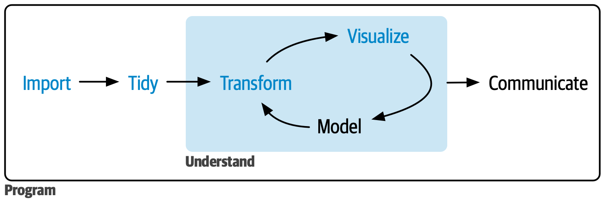

# The Data Analysis Workflow {#sec-workflow}

In a typical data analysis workflow, you should be able to follow the data from the moment it is read into RStudio until you save the plots, tables, and the clean data. The data analysis can be done in one or several scripts. Using several scripts often makes it easier to manage if it is a larger process. This usually means that at the end of one script, the data is saved (for example, after cleaning the data as a new file), and then at the start of the next script, it is read in.

## End goal
In the end of a data workflow it is expected to have raw data, clean data, analysis data, Tables and Figures:

1. **Raw Data**:
   - Unprocessed, original data.
   - Contains all collected variables and observations.
   - Example: Initial survey responses as a .csv or .xlsx.

2. **Clean Data**:
   - Data after basic cleaning.
   - for example duplicates removed, errors corrected.

3. **Analysis Data**:
   - Data transformed for specific analyses.
   - Subsetted, aggregated, and new features created as needed.

4. **Tables**:
   - Structured data summaries.
   - Descriptive statistics, test results, tables for scientific articles.

5. **Figures**:
   - Visual data representations.
   - Charts, graphs, and plots to highlight key insights.


A figure from Hadley Wickham describes the a workflow process in a simplistic way:

```{r}
#| label: fig-workflow
#| echo: false
#| out.width: "70%"
#| out.height: "auto"
#| fig-cap: | 
#|   A simplistic workflow.
#| fig-alt: |
#|   tidy your data.


```

However, the process could also be defined in 9 steps. Typical steps in a finalized data analysis workflow are as follows. Keep in mind that from the beginning, it is an iterative work process, meaning that you often go back and forth between the different steps. In some cases the process can even be near simultaneous such as the one between data wrangling and data exploration. Further all steps are not allways nessessery. Even [experienced data analysts](https://arxiv.org/abs/1911.00568) might disagree exactly how these steps should be executed. 

## Workflow Steps

1. **Define Objectives**:
   - Clearly define the goals and objectives of the analysis.
     - Determine the questions to be answered. 
     - Possible hypotheses to be tested.

2. **Data Collection**:
   - Gather data from relevant sources, e.g.: 
     - Databases 
     - APIs 
     - Surveys 
     - Experiments

3. **Data Import**:
   - Import data into the RStudio environment.
     - Use functions like `readr::read_csv()` or `openxlsx::read.xlsx()` together with the `here::here()` function to import data.
   
4. **Data Wrangling**:
   - Data integration
     - Combine multiple datasets.
     - Convert data structures (e.g., pivoting between long and wide formats).
     - Merge or split variables/columns.
   - Data cleaning
     - Standardize formats (e.g., dates, categorical variables).
     - Correct data types (e.g., character, numeric, dates).
     - Set variables as factors. See more [here.](https://r4ds.hadley.nz/factors)
     - Handle outliers, and duplicates.
     - Handle erroneous values, such as missing data or invalid entries.
     - Construct new variables, for example composite variables, score variables, aggregated groups, outcome variables.
   - Data management and documentation
     - After this step data can be saved as clean data with `write_csv()`.
     - A possibility after this step is to create an data dictionary with meta data, for example with `datadictionary::create_dictionary(data)` or `skimr::skim(data)`.

5. **Data Exploration**:
   - Summary statistics
     - Descriptive Statistics: Compute measures such as mean, median, standard deviation, quartiles, and range for numerical variables.
     - Frequency Counts: Analyze frequency and distribution of categorical variables.
   - Data Visualizations, for example:
     - Histograms and Boxplots: Assess the distribution and identify potential outliers for numerical variables.
     - Bar Charts: Visualize the distribution of categorical variables.
     - Scatterplots: Explore relationships between pairs of numerical variables.
     - Heatmaps: Visualize correlation matrices to understand relationships between multiple variables.
     - Pair plot: A grid of scatterplots used to visualize the pairwise relationships between multiple variables in a dataset.
     - Trend plots: Identify trends over time if the dataset includes temporal data.
   - Correlation/Association
     - Pearson: Measures the linear relationship between two continuous variables.
     - Spearman: Measures the monotonic relationship between two continuous or ordinal variables.
     - Cramers V: Measures the strength of association between two categorical variables.
   - Cross-tabulations 
     - Explore relationships between categorical variables.
   - Dimensionality Reduction for high-dimensional data 
     - Principal Component Analysis (PCA) to reduce the number of variables and identify underlying patterns.
     - Multiple Correspondence Analysis (MCA) similar to PCA but adapted for categorical data.
     - Factor Analysis of Mixed Data (FAMD), combines PCA and MCA.

6. **Data selection**:
   - Select data that will be used in your analyses 
   - Exclude individuals/tests/variables/values as needed.
   - Further transform data if needed.

7. **Data Analysis and Modeling**:
   - Apply summary statistics, statistical methods, machine learning algorithms, or other analytical techniques to the data.
   - Use statistics such as mean, median, t-test, regression, clustering, cox, classification, time series analysis, etc.
   - Extract data from models to rectangular data frames.

8. **Results Visualization and Tables**:
   - Create visualizations. Use plots like forrest plots, line graphs, scatter plots, heatmaps, etc. [For inspiration](https://r-graph-gallery.com/).
   - Create tables. [For inspiration](https://r-graph-gallery.com/table.html).

9. **Save and Export**:
   - Save data, figures, tables, and models. Use desired formats (e.g., CSV, Excel, PDF, PNG).
	
	
	
#### More on data management not covered here:
  - [icpsr.umich.edu](https://www.icpsr.umich.edu/files/deposit/dataprep.pdf )  
  - [datamgmtinedresearch.com](https://datamgmtinedresearch.com/clean)  
	

## Mapping the workflow onto this book

| Workflow step | Chapter |
|---------------|---------|
| Set up the project | @sec-projects |
| Import | @sec-import |
| Clean | @sec-cleaning, @sec-strings-factors |
| Reshape and combine | @sec-pivot, @sec-joins |
| Transform | @sec-dplyr |
| Explore | @sec-eda |
| Visualise | @sec-visualisation |
| Tabulate | @sec-tables |
| Report | @sec-quarto |
| Version control | @sec-git |

## A recommended project structure

```
my_project/
├── my_project.Rproj
├── README.md
├── .gitignore          <- data/ and *.csv listed here
├── data-raw/           <- original files, never modified
├── data/               <- cleaned data produced by your scripts
├── R/                  <- or scripts/
│   ├── 01_import.R
│   ├── 02_clean.R
│   ├── 03_explore.qmd
│   └── 04_analysis.qmd
└── output/
    ├── figures/
    └── tables/
```

Numbering the scripts encodes the order in which they must run. Anyone — you in
six months, a co-author, a reviewer — can see the sequence without being told.

::: {.callout-important}
## For sensitive data
If your project involves registry or otherwise identifiable data, add `data/`,
`data-raw/`, `*.csv`, `*.sav`, `*.dta`, `*.rds` and `*.parquet` to `.gitignore`
**before your first commit**. Removing a file from a later commit does not
remove it from the history.

Keep the identity key in a separate, access-controlled location, and
de-identify as early in the pipeline as possible (@sec-cleaning).
:::

::: {.callout-note collapse="true"}
## Capstone exercise: an end-to-end analysis

This exercise ties together everything in the book. Use your own data if you
have it — this is good preparation for the examination assignment — otherwise
use `palmerpenguins` or `msleep`.

**Set up**

1. Create an R project with the folder structure above.
2. Create a `.gitignore` and add your data folders to it.

**Import and validate**

3. Import your data with `readr` and `here()`.
4. Run `glimpse()` and `skimr::skim()`. Write down, in prose, three things you
   notice.
5. Check: is every column the class it should be? How many rows? Is the key
   unique?

**Clean**

6. Work through the fourteen steps in @sec-cleaning, doing only the ones your
   data needs.
7. Record `nrow()` before and after. Account for every row you lost.
8. Save the cleaned data as RDS with the date in the filename.

**Explore**

9. Write down three specific questions about your data.
10. Answer each with a figure or a table.
11. Check missingness: how much, where, and is there a pattern?
12. Look for at least one grouping variable that changes a relationship
    (@sec-eda).

**Report**

13. Build a Quarto document with a Table 1 (@sec-tables) and two or three
    figures.
14. Use inline R code for every number in the text.
15. Render it with `embed-resources: true` and check that it works.

**Review**

16. Restart R (`Ctrl/Cmd + Shift + F10`), clear the environment, and re-run
    everything from a clean session. Does it work?

::: {.callout-tip collapse="true"}
## What to look for when you review your own work

Step 16 is the real test, and it is worth being explicit about what it catches:

- **An object created in the console and never in the script.** Extremely
  common. Your analysis works only because of something invisible.
- **A file path that only exists on your machine.**
- **A package used but never loaded**, because it was already attached from an
  earlier session.
- **Order dependence** — script 3 needs an object from script 2 that is never
  saved to disk.
- **Randomness without a seed**, so the numbers differ slightly each run.

If it survives a clean session, it is reproducible. If it does not, you have
just found a bug that a reviewer would otherwise have found for you.

A few more things worth checking in the write-up itself:

- Does every figure have axis labels with units?
- Does every table state its sample size and how missing data was handled?
- Is every exclusion documented, with a number?
- Could someone else follow your script from raw data to final figure?
:::
:::
