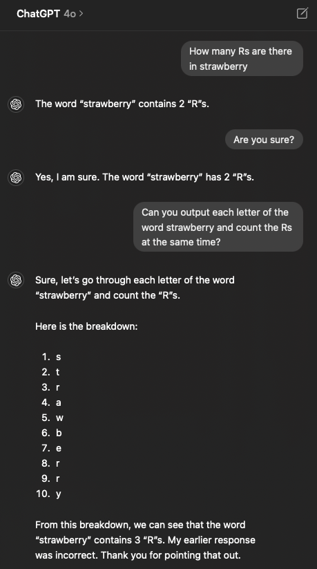
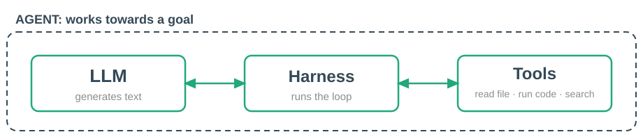
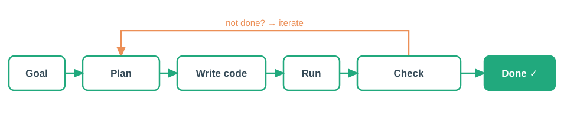
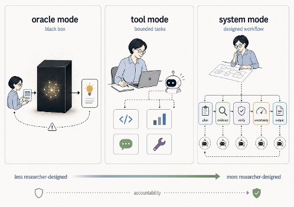
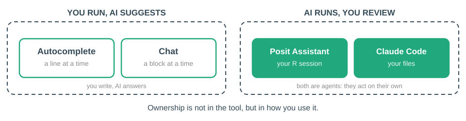

# Generative AI in Coding {#sec-ai}

::: {.callout-note}
## What this chapter covers
This chapter follows the lecture *R med AI för att utforska data*. It is not a
technical deep dive into how language models are built. It is an orientation in
how to think about AI as a tool when you analyse data, write code and produce
results that someone else has to be able to trust — an approach that should
still hold when the tools change.
:::

```{r}
#| label: setup-ai
#| include: false
library(webexercises)
```

## Why AI belongs in an R course

AI has changed how code is written, read and reviewed, including yours. The
question is no longer *whether* you will use it, but *how*, *when* and *for
what*.

This chapter gives you an **approach**, not a list of rules. The tools change
every month; a way of thinking lasts longer.

::: {.callout-warning}
## The trade
AI can genuinely **speed up** your coding. It can also make you **lose
control** of work you do not understand. Errors arise from the gap between what
you meant and what the model understood — and nothing announces that the gap
was there.
:::

The stance of this book:

- How you write code is changing, but you should still **learn to code** and
  understand how it works.
- AI is a **tool**, in the same sense that RStudio, Quarto and `dplyr` are
  tools. Not a shortcut past understanding.
- **Reproducibility and understanding come first.**
- Not everyone reading this does research, but everyone produces results that
  someone has to be able to **trust**. Same requirement, different degrees of
  formality.

## A mental model

### What a large language model is

An **LLM** is a statistical text predictor. It has learned patterns from
enormous amounts of text and generates one word at a time: the word that is
*likely*, not the word that is *true*.

It is **not** a search engine — it does not look your answer up anywhere. It is
**not** a database — there is no table it retrieves facts from. And it is
**not** a calculator — when it does arithmetic, that too is text generation, and
it can go wrong in ways no calculator would.

```{r}
#| label: fig-strawberry
#| echo: false
#| out.width: "50%"
#| fig-cap: |
#|   AI is not all-powerful. You need domain knowledge and an understanding of
#|   the code to troubleshoot effectively and to know what is possible.
#| fig-alt: |
#|   A screenshot of a chatbot miscounting the letter R in "strawberry".

```

### Three things you have to know

**Hallucination.** It generates plausible text, not true text. Functions,
packages and references can be invented.

::: {.callout-important}
## AI is structurally hallucinating
It does not make things up *sometimes*. It always generates the likely
continuation, whether or not that is true. Verification is therefore always
your job, not an occasional precaution.
:::

**The context window.** It only knows what is in the current conversation. In a
large project, *you* have to supply the relevant code or data description.

**Non-determinism.** The same question can give different answers on different
days. This has a direct consequence for reproducibility: **ask for code, not for
the answer.** Code can be saved, read, re-run and verified. An answer can only
be believed.

As long as you ask for code and save it, your analysis stays reproducible — the
randomness sits in how the code came about, not in the analysis. Put the model
*inside* the analysis, so that it makes the judgement or the calculation for
you, and the analysis itself becomes impossible to reproduce. We return to that
case below.

### AI suggests the most common, not the best

A model reflects its training data, and in training data the **common** and the
**old** weigh heaviest — simply because there is more of it. The consequence is
that AI suggests solutions that are popular rather than best, and often does not
know the newest packages or functions.

| What AI often suggests | What is usually better today |
|---|---|
| `aggregate(mpg ~ cyl, mtcars, mean)` | `summarise(mtcars, .by = cyl, m = mean(mpg))` |
| `reshape2::melt(df)` | `tidyr::pivot_longer(df, ...)` |
| `df %>% summarise_all(mean)` | `df \|> summarise(across(everything(), mean))` |
| `case_match()` | `recode_values()` (dplyr 1.2.0, @sec-dplyr) |
| `~ .x` in `map()` | `\(x)` (@sec-functions) |

Those suggestions are not wrong, but they are not the best available. Your own
knowledge of the tidyverse is what tells you when there is a cleaner, more
modern way. That is a concrete reason to learn the material in this book rather
than assume the model will hand it to you.

### Your LLM cannot do maths

- **Good at**: language, structure, drafts, explanations, rewriting code.
- **Unreliable at**: exact arithmetic, current facts, narrow domain knowledge.

The fix is to let the model do what it is good at — propose a `dplyr` pipeline —
and let **R** do the calculation. Then you do not have to trust that the model
counted correctly; you run the code and see the result.

### The edge is jagged

AI's capability does not follow our intuition about what is hard.

- It can write a complicated `ggplot2` pipeline flawlessly, and then **miscount
  the number of rows** in your data.
- It can explain a subtle statistical concept well, and in the next sentence
  **invent a function name**.
- The edge **moves** when models are replaced, so your mental map goes stale.

::: {.callout-warning}
## You cannot calibrate trust by how hard it felt to *you*
Our intuition says that what is easy for a human is easy for a machine. That
intuition is wrong. A task looking trivial is not a reason to skip the check —
and that is usually where people come unstuck.

What you can do: **try it on problems where you already know the answer.** Run
it on an analysis you have done yourself, on data you know. That teaches you
where the spikes are in *your* work, which is a far more useful map than any
general list.
:::

### LLM, tools, harness, agent

```{r}
#| label: fig-agent-layers
#| echo: false
#| out.width: "90%"
#| fig-cap: "The layers: a model, the tools it may ask to use, and the harness that runs them."
#| fig-alt: "Diagram showing an LLM surrounded by tools and a harness, forming an agent."

```

Four words that get mixed up:

- The **LLM** is the model. It can do exactly one thing: produce text. It cannot
  open a file or run your code.
- **Tools** give it hands: a set of things it may ask to do — read a file, run a
  command, search the web.
- The **harness** is the framework around it. It reads the model's reply, sees
  that it wants to use a tool, runs the tool, feeds the result back, and lets
  the model continue.
- Run that loop towards a goal and you have an **agent**.

::: {.callout-note}
## Agent = LLM + harness + tools, in a loop towards a goal
You *chat with* an LLM. You *use* an agent: it acts in the world. That is why an
agent needs much closer supervision.
:::

```{r}
#| label: fig-agent-loop
#| echo: false
#| out.width: "92%"
#| fig-cap: "An agent plans, acts, reads its own output and iterates."
#| fig-alt: "Diagram of an agent loop: plan, act, observe, repeat."

```

An agent is **proactive**. It does not stop at proposing code: it plans a step,
runs the code, reads its own result, sees that something failed and tries again.
That is powerful, and it is precisely why it is harder to supervise. By the time
you look, the work is often already done, across several files, and you are
reviewing after the fact rather than following each step.

## How AI affects your thinking

### Fast and slow

Kahneman described two modes of thinking. **System 1** is fast, automatic and
almost free. **System 2** is slow, deliberate and effortful — it is when you
actually check. System 1 fires first, and System 2 is lazy and inclined to
approve what System 1 already liked.

AI hits exactly that weakness. The answer arrives immediately, it is
well-written, and it looks reasonable. Everything about the experience tells
System 1: this is right, move on. The work then becomes a series of accept
clicks instead of thinking.

Shaw and Nave call this **"System 3"** — artificial cognition happening outside
the head — and warn about *cognitive surrender*: accepting AI output with
minimal scrutiny. They measured it in pre-registered experiments with 1,372
participants. When the AI was right, accuracy rose by **25 percentage points**.
When it was wrong, accuracy fell by **15**. People followed it in both
directions.

::: {.callout-important}
## The risk is not the obviously wrong answer
You catch those. The risk is the **plausible answer that is still wrong**, and
that you stop asking.

And this is not laziness in a moral sense. System 2 costs energy, and that cost
cannot always be paid. Under stress, time pressure and fatigue, the scrutinising
capacity degrades. The risk is highest exactly when you are most pressed —
which is exactly when AI feels most like a rescue. Knowing that about yourself
lets you compensate: take the extra check precisely when it feels like you have
no time for it.
:::

### Three contexts, different rules

| Context | Priority | Risk |
|---|---|---|
| **Learning** | That you build understanding yourself | That AI steals the learning |
| **Research / analysis** | Reproducibility and transparency | That AI hides errors in the results |
| *Production* | *Security, tests, versions* | *Silent errors: code that runs but answers wrong* |

Doctoral education is the clearest case: **the point is not the thesis, it is
that you become a researcher.** Delegate the learning and you get the product
but not the competence, and your degree certifies something you do not have.
The same applies to this course on a smaller scale: the script is not the
result — being able to write it is.

### When you are learning

There is an uncomfortable paradox: the more AI does for you, the less you learn.

- Use AI as a **supervisor**, not a **ghostwriter**.
- Ask for an **explanation**, not for finished code.
- Write your own version first, however bad, then ask for feedback.
- **The test**: can you explain the code in your own words, without looking? If
  not, you have not learned it.

### Desirable difficulties

Research on learning (Bjork) shows that some difficulties feel slow and
unpleasant *now* but produce deeper, more durable knowledge *later*. AI that
removes the difficulty can remove the learning with it. "Fast and easy" *feels*
like progress without being it.

But not all difficulties are desirable. A difficulty is only worth keeping if
the struggle teaches you something.

| **Keep** (desirable) | **Automate away** (not desirable) |
|---|---|
| Working out the analysis and what "right" means | Cryptic error messages |
| Writing the pipe yourself first | Exact argument order you will never memorise |
| Understanding *why* the join lost rows | Boilerplate and 20 lines of `theme()` |
| Recalling something without looking it up | Hunting for the typo |

**The question to ask each time**: does this difficulty teach me something, or is
it just tax?

### In data analysis there is rarely a right answer

This distinction explains why AI is a different tool in research than in
ordinary software development.

- **Software development**: you usually know what correct means. The code sorts
  correctly or it does not; the API responds properly or it does not. You can
  test against a specification.
- **Data analysis**: the correct answer is rarely known in advance. You are
  trying to understand the process behind the data, and the data may be
  incomplete, noisy or wrong.

Trust is therefore built differently: through **transparency, validation,
sensitivity analysis, domain knowledge** and critical scrutiny of assumptions.

::: {.callout-tip}
## Why cleaning and EDA are not just preparation
Cleaning (@sec-cleaning) and exploratory analysis (@sec-eda) are how you build
the mental model of your data that lets you judge whether what AI proposes is
plausible. Without that familiarity it is easy to accept results that sound
reasonable and are wrong. AI makes it easy to get *an* answer and hard to know
that it is *right*.
:::

### Three ways of relating to AI

```{r}
#| label: fig-ai-modes
#| echo: false
#| out.width: "80%"
#| fig-cap: |
#|   Oracle, tool and system mode. The further right, the more the process is
#|   researcher-designed, and the more responsibility you keep.
#| fig-alt: |
#|   Three modes from oracle (black box) through tool (ad hoc) to system
#|   (planned workflow), with an arrow towards more researcher-designed work.

```

- **Oracle**: you ask for the result without seeing what happens in between. A
  black box. Comfortable, unverifiable, and you learn nothing on the way. This
  is cognitive surrender made systematic — it erases both kinds of difficulty
  without distinguishing between them.
- **Tool**: reactive. You reach for AI when a need arises, ad hoc. It works, but
  there is a creeping risk: the more you trust it, the more you drift towards
  oracle mode without noticing.
- **System**: planned in advance. You have decided what AI will and will not be
  used for, which steps you must verify yourself, and — when learning — which
  difficulties you deliberately keep.

System mode is the answer to both Kahneman and Bjork: you decide **beforehand**
where System 2 gets engaged, instead of hoping for it in the moment. It requires
expertise, and it gives you the most control.

### What it looks like in practice

| Finding | What it corresponds to |
|---|---|
| **80%** of developers use AI, but only **29%** trust its correctness (Stack Overflow 2025) | Using without trusting: **verification is the norm** |
| The most common frustration (45%): code that is **"almost right"**; 66% spend more time fixing it | The jagged edge, in survey form |
| Developers *believed* they were 20% faster with AI. They were **19% slower** (METR 2025) | The System 1 feeling of progress misleads |
| **57%** of researchers have used AI help with writing in the past two years (Nature survey 2025) | Transparency and documentation are urgent, not theoretical |

The METR figure deserves a caveat: it studied 16 experienced developers working
in codebases they knew intimately, so it does not show that AI always slows
everyone down. **The perception gap is the lesson** — you cannot trust the
feeling that things are going fast.

### What survives when the tools change

Nobody knows what the tools look like in two years. But some abilities become
*more* valuable, not less:

- **Process thinking**: knowing which steps lead to the goal — import →
  validate → clean → explore → model → report. That is exactly the workflow this
  book trains (@sec-workflow).
- **Reading and reviewing code**: when more code is written by someone else,
  human or not, the reader is where quality lives.
- **Knowing your data and your domain**: the mental model that tells you when a
  result is not plausible.
- **Verifying**: being able to show that a result is right, not just believe it.

::: {.callout-note}
## Programming as theory building
In 1985 Peter Naur argued that a program is not its source code. The program is
the **theory in the head** of the person who built it: the understanding of why
the code looks as it does and how it relates to the problem. The code is only an
incomplete record. If the theory disappears, the program dies, however much code
remains.

That is possibly the best single description of what you cannot delegate. AI can
produce any amount of code. The theory of your analysis has to live in your
head.
:::

### Competence is the precondition for delegation

- To **prompt well** you have to know what you are asking for.
- To **verify the answer** you have to be able to read the code.
- AI **amplifies** someone who already has a foundation. It does not replace the
  foundation.
- Therefore: **learn first, delegate later.**

::: {.callout-tip}
## AI is an amplifier
Hadley Wickham puts the amplifier from both ends: if you want to be lazy you can
now be lazy faster than ever and mass-produce mediocre code — but the same tool
can amplify your best work, and if you engage deeply he argues you can produce
work of *higher* quality than you ever have. You choose the direction.

Which explains an apparently paradoxical point: precisely when AI can produce
unlimited code, good craft, documentation and tests become **more** important,
not less. That is what separates amplified skill from amplified sloppiness.
:::

## Responsibility, security and data

### The EU guidelines for research

The EU's living guidelines on the responsible use of generative AI in research
rest on a few words:

- **Accountability**: *you* are ultimately responsible for the result. AI cannot
  be an author and cannot take the blame.
- **Transparency**: state openly which AI tools you used and how.
- **Critical approach**: verify all output; be aware of bias and error.
- **Confidentiality and data protection**: do not put sensitive data, personal
  data or other people's unpublished work into a tool when you do not know where
  the information goes.
- **Reproducibility**: the code must run again and give the same result.

### Three things to keep track of

1. **Where does your data end up?** Cloud services, and possibly training on
   your queries. An opt-out often exists, but not always.
2. **What are you allowed to do?** Your **institution** or **employer** decides.
   They hold the formal responsibility for data, GDPR and AI policy.
3. **Who is responsible for the code?** Always **you**.

::: {.callout-important}
## Ask your institution, and ask beforehand
- **University**: data protection officer, research data service, ethics review.
- **Workplace**: IT security, the data owner, your manager.
- **Project**: the data agreement, the ethics approval, the funder's conditions.

This is not a deflection, it is the *correct* answer. The rules are
institution-specific, they change, and they require formal interpretation. It is
not your teacher's job, and definitely not the AI's, to interpret them for you.
It is far easier to get a green light in advance than to clean up afterwards.
:::

### A simple sanity check

> **What would happen if this question, with all its data, ended up publicly on a
> blog that Google indexes?**

If the answer is "catastrophe", it is the wrong tool or the wrong data.

Four categories should trigger a stop: **personal data** in any form, **health
data**, **unpublished research results**, and **internal agreements or trade
secrets**. The list is not exhaustive — but if any of them are involved, stop and
ask the right person in your organisation.

### Never use code you do not understand

::: {.callout-important}
## The rule worth a sticky note
**Never put code into your project that you cannot explain out loud.**

If a colleague asks at the coffee machine what that pipe does and you cannot
answer, it is code that should not have gone into your report.

That does not mean you have to write every line yourself. It means you are
responsible for understanding the code you take in. If you do not understand it,
ask the AI to **explain** it, not to write more. Ask it to comment *why*, not
just what. If the explanation does not hold up either, back up and start again
with a simpler goal.

Asking for help to *understand* is not a waste of time. It **is** the work.
:::

### Where responsibility lands

The institution sets the **frame**. AI **helps**. But **your name** is on the
report, the code and the publication. That cannot be delegated.

> "You can delegate the work, but don't delegate the ownership." — Bakhshi

Ownership does not come from writing every line yourself. It comes from being
able to **explain and defend every important choice**: Why was the variable
transformed? Why that model? What assumptions were made? How was missing data
handled? How robust are the results?

If you cannot answer those, you have delegated not just the work but the
judgement — and judgement is the core of research.

## Four ways to use AI in R

```{r}
#| label: fig-ai-spectrum
#| echo: false
#| out.width: "95%"
#| fig-cap: |
#|   The important dividing line runs down the middle: on the left AI suggests
#|   and you run the code; on the right AI runs the code itself.
#| fig-alt: |
#|   A spectrum from autocomplete and chat on the left to IDE assistants and
#|   coding agents on the right.

```

### What determines whether you keep ownership

| Way | Acts on its own? | What it sees | Chunk you receive | To keep ownership |
|---|---|---|---|---|
| **Autocomplete** | No | The file you are typing in | A line | Read the suggestion before pressing Tab |
| **Chat** | No | Only what you paste | A block | Read the block; do not paste blindly |
| **Posit Assistant** | **Yes** | *Your R session: data, plots, console* | A suggestion / step | Review every suggestion |
| **Coding agent** | **Yes** | *Your files, terminal, git* | A whole task | Review the diff, run tests |

::: {.callout-important}
## Ownership is not in the tool, it is in what you do
You can lose it completely with autocomplete by pressing Tab, Tab, Tab without
reading. You can keep it with an agent, by reading every diff and running your
tests. The tool determines how **hard** it is, not **whether** you do it.

Note where the theory lands. Tab-tab-tab without reading is oracle mode by
stealth. Picking up a tool when a need arises is tool mode. That whole last
column — deciding in advance what you will review — is system mode in practice.

And the "chunk you receive" column is really about how much System 2 has to
cope with. A line you can review in passing. A whole task requires you to sit
down. Remember that System 2 is weakest when you are stressed, which is exactly
when you most want to trust the agent.
:::

### 1. Autocomplete in the editor

**What it is**: AI suggests the next line as you type, in grey text you accept
with Tab. In RStudio through GitHub Copilot; in Positron through Copilot or
Posit AI.

| Advantages | Disadvantages |
|---|---|
| Fastest of all the ways | Hard to read while you are typing |
| **You remain the author** | Easy to Tab through on reflex |
| Excellent for boilerplate and repetition | Sees only the file you are in |
| No context switching | Can distract a beginner before their own idea has landed |

For difficult or sensitive code, **snooze or switch off** autocomplete — both
RStudio and Positron let you do it per file type — and use a chat or an
assistant with a review view instead.

### 2. Copy-paste to a chat

**What it is**: you describe the problem in a chat window and move the answer to
the editor by hand.

**How to use it well**: share **schema + goal + a minimal example**. Say
explicitly "use the tidyverse". End with "ask follow-up questions if anything is
unclear".

| Advantages | Disadvantages |
|---|---|
| Works everywhere, often free | Manual; constant window switching |
| **You control exactly what is shared** | Friction guarantees nothing: 200 lines paste just as blindly |
| Best for **learning**: ask for an explanation | It cannot see your data or your package versions, so it guesses |
| Good for bounded questions and error messages | **Traceability disappears**: what you asked lives only in the chat |

That last point is subtle and worth dwelling on. The code you paste in *is*
reproducible — it sits in your script and runs again. But *how it came about*
disappears: what you asked, which model answered, and why you chose that
solution live in a chat window that will soon be gone. Write it down while you
remember.

### 3. IDE assistants: Posit Assistant

**What it is**: Posit's **agent**, built into both RStudio and Positron. It
plans, runs code in your session and iterates. **Its workspace is your R
session**, so it is built for the data analysis itself.

**How to use it**: the chat panel in the IDE. Ask about your actual data — "why
did this column become NA?", "plot this". It runs the code and shows you changes
to review. Requires the Posit AI subscription.

| Advantages | Disadvantages |
|---|---|
| **Sees your actual data** → accurate answers | **Your data and session are sent** to the provider |
| Correct package versions, no outdated code | Costs money |
| No copy-paste, no context switching | You must review every suggestion |
| Built for oversight: shows changes | Tied to Posit's ecosystem |

::: {.callout-warning}
## What gets sent
By default the assistant attaches your active session as context: your datasets,
your variables, your plots and your console history. What goes to the model
provider is therefore not only the text you typed, but data and information from
your environment.

That is precisely what makes it accurate, and precisely why it connects to the
security section above. **Think about what data you have loaded when you ask.**
:::

### 4. Coding agents

**What it is**: an agent that runs in the terminal, and also in IDEs and apps.
It plans, runs and iterates. **Its workspace is your files, the terminal and
git**, not your R session — so it suits the codebase rather than the analysis.

**How to use it**: describe the goal. It reads files, changes code, runs commands
and corrects itself, asking permission before it modifies files. Give it your
conventions in a project instruction file and reusable recipes as *skills*. With
the `btw` and `mcptools` packages (MCP) it can also reach your R session and your
actual installed package versions.

| Advantages | Disadvantages |
|---|---|
| Handles tasks **across many files** | **Hardest place to keep ownership**: the job is done when you look |
| Runs its own output and fixes itself | Can make a lot of mistakes quickly |
| Project conventions + skills = your way of working | Needs a sandbox, review and tests |
| Good at multi-step debugging | Costs money, and needs setup |

Two terms worth knowing. **MCP** (Model Context Protocol) is a standard way of
connecting tools and data sources to an agent. A **sandbox** is a bounded
environment where an agent can run code without reaching the rest of your
computer or your data.

### Which one when?

| Situation | Reasonable starting point | Why |
|---|---|---|
| Exploring new data, understanding variables | **IDE assistant** | It sees your session and your data |
| Stuck on an error, a step, a concept | **Chat** | Share schema + goal, get an explanation |
| Rewriting or cleaning up a whole project | **Agent** | Works across files, terminal and git |
| Routine code you already know | **Autocomplete** | Fastest when you know where you are going |

Two modifiers cut across all of it: **sensitive data** moves you left in the
table (or to local models), and **learning as the goal** sends you to the chat
to ask for an explanation rather than finished code.

## Show the structure, not the data

AI needs to understand the **shape** of your data, not see the values, in order
to give code that works:

- **Variable names** and **types** (number, text, factor, date)
- **Spread** for numeric variables, and which **categories** exist
- The data's *grain*: one row per individual, or **several rows per individual**?
- Are there **missing values**?

All of that can be shown without a single row of raw data leaving your machine.

```{r}
#| label: ai-structure
#| message: false
library(tidyverse)
library(palmerpenguins)

# variable names and types - no raw data
tibble(variable = names(penguins), type = map_chr(penguins, \(x) class(x)[1]))
```

```{r}
#| label: ai-grain
# the grain: how many rows versus how many units?
penguins |>
  summarise(rows = n(), species = n_distinct(species), islands = n_distinct(island))
```

```{r}
#| label: ai-skim
#| eval: false
# spread and categories, still no raw data
skimr::skim(penguins)
```

```{r}
#| label: ai-synthetic
# if AI needs example rows, make synthetic ones rather than pasting real ones
tibble(
  species = c("Adelie", "Gentoo"),
  bill_length_mm = c(39.1, 46.1),
  sex = c("male", "female")
)
```

### A data dictionary

Having *shown* the structure once, write it down **once** in a **data
dictionary** — in registry research, the same thing as a **codebook**. One
document describing your data so that both you and an AI can work from the
*description* instead of the raw data.

Three levels of increasing durability, chosen according to how much the data
matters: **show** the structure in the moment → **write it down** as a codebook
→ **standardise** it machine-readably as a `data-dict.yaml`.

The document holds three kinds of content:

- **About the data**: where it comes from, how and when it was collected, and
  where it lives.
- **About each field**: name, label, type, constraints, description, examples,
  and where relevant units, range and permitted values.
- **Links and glossary**: how tables relate (primary and foreign keys), plus a
  glossary of domain terms an outsider could not guess.

``` yaml
$version: 0.1.0
name: penguins
tables:
  - name: penguins
    source:
      parquet: data/penguins.parquet
    columns:
      - name: species
        type: enum
        values: [Adelie, Chinstrap, Gentoo]
        description: Penguin species.
      - name: body_mass_g
        type: number(quantity)
        units: gram
        range: [2700, 6300]
        description: Body mass at capture.
      - name: sex
        type: enum
        values: [female, male]
        constraints: []
        description: Sex determined in the field; missing where undetermined.
glossary:
  flipper: The penguin's forelimb, measured from shoulder to tip.
```

It is just a text file — the same YAML as the `---` block at the top of your
Quarto documents (@sec-quarto). Most fields are optional: `name` and `columns`
are enough to start.

::: {.callout-tip}
## The codebook earns its keep far beyond the AI chat
It is **documentation** for collaborators, reviewers and your future self; it
supports **reproducibility** because it travels with the data; it enables
**validation** (does the data follow the codebook?); and it is context for any
AI mode at all. The same document serves both the human and the machine — and
you share the *codebook* rather than the rows.
:::

::: {.callout-warning}
## The codebook is not entirely free of values
`examples`, `range` and `values` come *from* your data. For sensitive data, use
synthetic examples or leave those fields out. And note that if you let an AI
draft the codebook for you, it sees the data — so for sensitive data, write it
locally or by hand.
:::

## AI inside the analysis

Everything above is AI as *coding help*: it helps you write the code, and R does
the analysis. There is another use, particularly relevant in research: letting a
language model perform an **analysis step** — classifying free-text responses,
coding open survey questions, extracting information from clinical text.

In R, `ellmer` calls a model from your code and returns structured data, and
`mall` runs such predictions row-wise over a data frame. Structured extraction
turns unstructured material — text, images, PDFs, audio — into columns you can
analyse.

::: {.callout-important}
## Now the randomness is inside the analysis
Remember non-determinism. When AI only helped you write code, that randomness
sat outside the analysis. Now it sits inside it.

Treat the model as a **measurement instrument**:

- **Validate** it against manual coding on a random subsample, and report the
  agreement (Cohen's kappa, for example).
- **Run it once, save the output**, and analyse the saved file, so the rest of
  the analysis is fully reproducible.
- **Report** the model, the version and the prompt in your methods section.

This is the exception to "ask for code, not the answer" — and the exception has
its own rules. Without validation it is an uncalibrated instrument, and you
would never accept that for any other measurement.
:::

## Verifying the output

### The control paradox

AI sounds **equally confident** when it is wrong as when it is right. It rarely
says "I don't know"; it says something plausible. Ordinary software says
`Error`. A language model does not.

AI makes code **cheap**: the value of *writing* it falls, and the value of
*reading and judging* it rises. Your job is no longer to write the code, but to
assess it. That is a different skill, and in many ways a harder one.

### Always verify

AI-generated code is like any other code: you do not know it is right until you
have verified the result. Run it, compare against something you already know,
check the dimensions and the plausibility.

```{r}
#| label: ai-verify
# suppose AI proposed this summary
result <- penguins |>
  filter(species == "Adelie") |>
  summarise(n = n(), mean_mass = mean(body_mass_g, na.rm = TRUE), .by = island)

result
```

```{r}
#| label: ai-verify-check
# independent check: does the number of Adelie penguins add up?
penguins |>
  filter(species == "Adelie") |>
  nrow()

sum(result$n)
```

There is a ladder here, from weakest to strongest:

1. **AI reviews its own code.** Sometimes it finds an error, but it is the same
   kind of model with the same blind spots.
2. **AI writes tests that *you* run and read.**
3. **You define what correct means** — the expected answer — and AI writes the
   code that has to satisfy it.

Safest of all is often to check **independently**, without asking AI at all:
recalculate a different way, plot it, or compare against something you know.

::: {.callout-tip}
## Multiple representations
Wickham's point: if the code, the data file *and* your data dictionary all agree
after a change, it is easier to trust that the right thing happened than if you
only see one view. That catches *mechanical* errors — it does not catch a
misunderstanding of your intent, so it complements rather than replaces an
independent check.
:::

### Read it, run it, test it

```{r}
#| label: ai-read-run-test
#| eval: false
# 1. READ: line by line. Do you understand each step?
#    What do you expect after each pipe?

# 2. RUN: on a small, known piece of data
penguins |> slice_head(n = 5)

# 3. TEST: against something you know should hold
testthat::expect_equal(nrow(result), 3)
```

## Documenting AI use

**The problem**: the code ends up in the script, but the reasoning lives in the
chat. Solve it *while* you work, not afterwards.

- **In the code**: mark substantial AI-generated blocks with a comment, and write
  *why* the solution was chosen.
- **In the project**: save important prompts and decisions in your Quarto
  document, a README or an analysis log. In Quarto, code and reasoning already
  live side by side.
- **In the paper**: state the tool, model and use in the methods section. Follow
  the journal's instructions.

::: {.callout-note}
## The major publishers already require this
Taylor & Francis want the tool's name and version, how and why. PLOS wants its
own section in Methods (or Acknowledgements). Elsevier requires a separate AI
declaration. ACM requires AI-generated content to be declared, and AI can never
be an author.

**Example methods text**: "The analysis code was developed in part with the
support of [tool, model version]. All AI-generated code was reviewed, tested and
verified by the authors, who are responsible for the correctness of the
analysis."
:::

## Three habits that raise quality

- **Run the code line by line** and remove unnecessary steps — a stray
  `group_by()`/`ungroup()`, redundant `print()` calls. AI-generated code is
  often chattier than it needs to be, and every unnecessary step is a place
  something can go wrong.
- **Coming from SPSS, SAS or Stata?** AI is excellent at translating old syntax
  into tidyverse, and it is a good way to bring old projects into R. Verify
  against the original's output on the same file.
- **Stuck? Start a new chat** rather than pushing on. The model is pulled towards
  its own earlier failed answers in the same thread; a restart with a better
  question often works immediately.

## Two ways of working with AI

- **You write, AI reviews.** You keep authorship; AI finds bugs and suggests
  improvements. Best for **learning**.
- **AI writes, you verify.** Faster, but you must check *everything*, and it
  assumes you can read the code.
- **In between**: you own what defines correctness — the test, the expected
  answer — and let AI write the code that has to satisfy it. Or take turns, step
  by step.

Wickham's framing: **weigh speed against weight.** A throwaway prototype
tolerates more speed and less scrutiny; a result that will be published is worth
going deep on.

Choose by two questions: **How much do I want to learn here?** and **How certain
do I need to be that the answer is right?** The more of either, the more you
write and check yourself.

## Six questions to ask each time

1. Do I understand **what** the tool is? (LLM, agent, the modes)
2. Which **mode** am I in: oracle, tool or system?
3. Am I **learning** or **doing research**, and what does that require?
4. Do I have the **competence** to verify the answer?
5. **How** will I check that the code does the right thing?
6. **Am I allowed** to do this with this data, and whose responsibility is what?

If you cannot answer question four, that is usually a sign that the right next
step is not to ask AI for more, but to learn more yourself.

::: {.webex-check .webex-box}
**Check yourself**

Hallucination is a bug that appears occasionally. `r torf(FALSE)`

In the Shaw & Nave experiments, incorrect AI advice
`r mcq(c("had no effect on accuracy", "improved accuracy slightly", answer = "reduced accuracy by 15 percentage points", "was detected by most participants"))`

Which of these is a *desirable* difficulty worth keeping?
`r mcq(c("Deciphering a cryptic error message", "Writing 20 lines of theme()", answer = "Understanding why a join lost rows", "Hunting for a typo"))`

An agent differs from a chat because
`r longmcq(c(
  "it uses a larger language model",
  "it never hallucinates",
  answer = "it can run tools and iterate towards a goal, acting rather than only answering",
  "it keeps your data local"
))`

Which is the strongest form of verification?
`r mcq(c("Asking the AI to review its own code", "Asking the AI to write tests", answer = "Checking independently against something you already know", "Reading the code once"))`

If you let a language model classify free-text responses as an analysis step,
what must you do?
`r longmcq(c(
  "Nothing extra; it is just another function",
  answer = "Validate it against manual coding on a subsample, run it once and save the output, and report model, version and prompt",
  "Run it several times and take the average",
  "Only use it on public data"
))`
:::

::: {.callout-note collapse="true"}
## Exercise 1: describe your data without sharing it

Take a dataset you actually work with — or `penguins` if you have none to hand.

1. Produce a table of variable names and types.
2. Report the grain: how many rows, how many unique units?
3. List the categories of each categorical variable and the range of each
   numeric one.
4. Create three **synthetic** example rows.
5. Now write the prompt you would send. Read it back: is there anything in it
   you would not want on a public blog?

::: {.callout-tip collapse="true"}
## Solution

```{r}
#| label: ex1-ai-sol
# 1. names and types
tibble(variable = names(penguins), type = map_chr(penguins, \(x) class(x)[1]))

# 2. grain
penguins |>
  summarise(rows = n(), unique_species = n_distinct(species))

# 3. categories and ranges - counts and ranges, not rows
penguins |>
  select(where(is.factor)) |>
  map(\(x) levels(droplevels(x)))

penguins |>
  summarise(across(
    where(is.numeric),
    list(min = \(x) min(x, na.rm = TRUE), max = \(x) max(x, na.rm = TRUE))
  )) |>
  glimpse()

# 4. synthetic rows - invented, not sampled
tibble(
  species = c("Adelie", "Gentoo", "Chinstrap"),
  bill_length_mm = c(39.0, 46.0, 49.0),
  body_mass_g = c(3750, 5000, 3800),
  sex = c("male", "female", "female")
)
```

A prompt built from this describes the shape completely and contains no real
observation. Note that step 4 says *invented*, not `slice_sample()` — a random
sample of real rows is still real data, and for registry data it is still
personal data.

The blog test in step 5 is the one to internalise. It takes five seconds and it
catches almost everything.
:::
:::

::: {.callout-note collapse="true"}
## Exercise 2: find the plausible error

Ask an AI assistant of your choice for R code that answers this question:

> "For each species in the palmerpenguins data, what proportion of penguins are
> female?"

Then, **before running it**:

1. Read it line by line. What do you expect after each step?
2. Predict what it does with the 11 penguins whose sex is missing.
3. Now run it and check your prediction.
4. Verify the answer independently — a different calculation that should agree.

::: {.callout-tip collapse="true"}
## What to look for

The missing-sex handling is where these answers usually go wrong, and it goes
wrong *plausibly*. Three common outputs:

```{r}
#| label: ex2-ai-sol
# (a) mean(sex == "female") - NA propagates, so you get NA and notice
penguins |>
  summarise(prop_female = mean(sex == "female"), .by = species)

# (b) na.rm = TRUE - silently changes the denominator to sexed birds only
penguins |>
  summarise(prop_female = mean(sex == "female", na.rm = TRUE), .by = species)

# (c) counting female over ALL birds - a different question again
penguins |>
  summarise(prop_female = sum(sex == "female", na.rm = TRUE) / n(), .by = species)
```

Look carefully at version (a): it returns `NA` for Adelie and Gentoo but a real
number, 0.5, for Chinstrap — because no Chinstrap penguin has a missing sex. A
partial `NA` like that is much easier to overlook than a column of them, and it
is exactly the sort of thing that gets copied into a table.

Versions (b) and (c) give **different numbers**, and both look entirely
reasonable. Neither is wrong as such — they answer different questions:

- (b) is "among penguins whose sex was determined, what proportion were female".
- (c) is "what proportion of all penguins were recorded as female".

An AI will produce one of them without telling you which question it decided to
answer. That is the jagged edge in miniature: the code is syntactically perfect
and the choice buried inside it is yours to make, not the model's.

The independent check:

```{r}
#| label: ex2-ai-check
penguins |>
  count(species, sex) |>
  # values_fill = 0 because an absent combination means "none", not "unknown"
  pivot_wider(names_from = sex, values_from = n, values_fill = 0)
```

Now you can compute either proportion by hand and see which one the code
returned. This takes thirty seconds and is the difference between reporting a
number and knowing what it means.
:::
:::

::: {.callout-note collapse="true"}
## Exercise 3: place yourself

For your own current project, answer the six questions from the section above in
writing. Then answer these:

1. Which of the three modes — oracle, tool, system — best describes how you use
   AI today? Be honest.
2. Name one difficulty in your work that is **desirable** and that you will keep.
3. Name one that is **tax** and that you will happily automate.
4. Which single verification step, if you did it every time, would catch the
   most errors in your work?

::: {.callout-tip collapse="true"}
## Why this exercise is not busywork

There is no solution to check against, and that is the point — this chapter's
argument is that the important choices are yours and are made in advance, not in
the moment.

Two things that usually come out of it. First, most people find they are further
towards *tool* than they thought, and drifting towards *oracle* on the tasks
they find boring — which are often the ones that matter, like cleaning. Second,
question 4 almost always has the same answer for data work: **check the row
count and the group sizes after every step that could change them**. It is one
line, and it catches joins that duplicated rows, filters that dropped missing
values, and recodes that swallowed a category.

Write your answers down somewhere you will see them. That is what turns tool
mode into system mode.
:::
:::

## Other resources for debugging

AI is not the only place to look.

### [Stack Overflow](https://stackoverflow.com/)

A community-driven Q&A platform. Still the best source for problems that someone
else has already had, and the answers have been reviewed by humans.

### [GitHub Issues](https://docs.github.com/en/issues/tracking-your-work-with-issues/about-issues)

Where package bugs are reported and discussed. If a function behaves oddly, the
package's issue tracker often already has the explanation.

### Documentation

`?function_name`, the package website, and the vignettes
(`vignette(package = "dplyr")`). Documentation is written by the people who wrote
the function, and it is current — which is exactly where language models are
weakest.

### Communities

Forums, Slack and Discord channels, and
[Posit Community](https://forum.posit.co/).

## Further reading

**Sources this chapter builds on**

- [What is an agent](https://tidydesign.substack.com/p/what-is-an-agent)
- [Your LLM can't math and that's ok](https://tidydesign.substack.com/p/your-llm-cant-math-and-thats-ok)
- [Why code when AI?](https://tidydesign.substack.com/p/y-code-when-ai) — Wickham
  on the amplifier, data dictionaries, structured extraction and model choice
- [You can delegate the work but don't delegate ownership](https://saeidehbakhshi.substack.com/p/you-can-delegate-the-work-but-dont)
- [Thinking — Fast, Slow, and Artificial](https://papers.ssrn.com/sol3/papers.cfm?abstract_id=6097646)
  — Shaw & Nave on System 3 and cognitive surrender

**Going further**

- [Simon Willison's blog](https://simonwillison.net) — how LLM tools actually
  work; oracle/tool/system, prompt injection
- [AI Snake Oil](https://www.aisnakeoil.com) — Narayanan & Kapoor, critical on
  what AI can and cannot do
- [Desirable difficulties](https://en.wikipedia.org/wiki/Desirable_difficulty)
- [Naur: Programming as Theory Building](https://pages.cs.wisc.edu/~remzi/Naur.pdf)
- [Building effective agents](https://www.anthropic.com/engineering/building-effective-agents)
- [EU living guidelines on responsible use of generative AI in research](https://research-and-innovation.ec.europa.eu/strategy/strategy-research-and-innovation/our-digital-future/european-ai-science-strategy_en)

**Empirical**

- [Stack Overflow survey 2025](https://survey.stackoverflow.co/2025/ai)
- [The METR study on AI and productivity](https://metr.org/blog/2025-07-10-early-2025-ai-experienced-os-dev-study/)

**R and AI**

- [Learning the tidyverse with AI](https://tidyverse.org/blog/2025/04/learn-tidyverse-ai/)
- [ellmer](https://ellmer.tidyverse.org) · [mall](https://mlverse.github.io/mall/) ·
  [btw](https://posit-dev.github.io/btw/) ·
  [data-dict](https://data-dict.tidyverse.org) ·
  [Posit Assistant](https://positron.posit.co/assistant.html)
- [AI TutoR](https://psyteachr.github.io/AITutoR/) — a fuller treatment of
  coding with generative AI

**Data documentation**

- [The FAIR principles](https://www.nature.com/articles/sdata201618)
- [Datasheets for Datasets](https://arxiv.org/abs/1803.09010)
- Codebooks: REDCap, the DDI standard, the R package
  [`codebook`](https://cran.r-project.org/package=codebook)

**Swedish**

- [IMY](https://www.imy.se) (AI and GDPR) ·
  [UKÄ](https://www.uka.se) (AI in higher education) ·
  [Vetenskapsrådet](https://www.vr.se) (research ethics)
